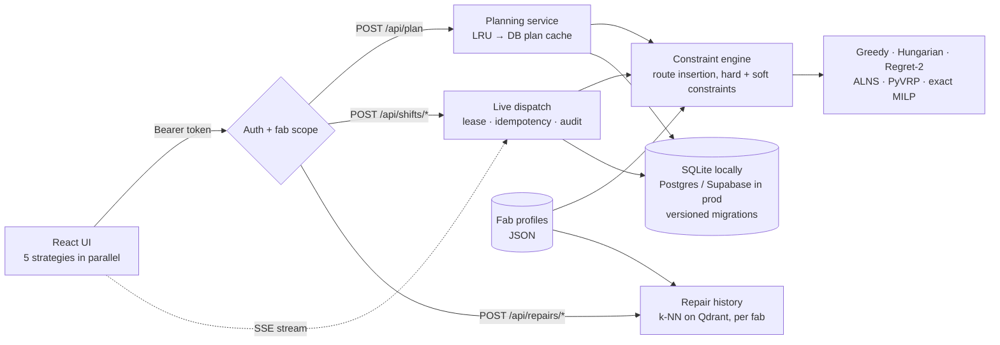

<div align="center">

# Fab Dispatch

**A resource allocation engine for semiconductor fab maintenance.**
Assigns equipment engineers to tool-downs and preventive maintenance in real time, across any number
of fabs, comparing five strategies from a one-pass greedy to a state-of-the-art vehicle-routing solver.

[](#quick-start)
[](backend/)
[](frontend/)
[](#testing)
[](#testing)
[](#quick-start)

[**Live app**](https://fab-dispatch.vercel.app) · [Quick start](#quick-start) · [Results](#results) ·
[Architecture](docs/ARCHITECTURE.md) · [Environments](docs/ENVIRONMENTS.md) · [Onboard a fab](docs/ONBOARDING_A_FAB.md) · [Analysis](docs/ANALYSIS.md)


</div>

---

## Contents

- [Why this exists](#why-this-exists)
- [Highlights](#highlights)
- [Results](#results)
- [Quick start](#quick-start)
- [Screenshots](#screenshots)
- [How it works](#how-it-works)
- [Multi-fab and access control](#multi-fab-and-access-control)
- [API](#api)
- [Configuration](#configuration)
- [Testing](#testing)
- [Delivery: dev → UAT → production](#delivery-dev--uat--production)
- [Project structure](#project-structure)
- [Documentation](#documentation)
- [Limitations and roadmap](#limitations-and-roadmap)

## Why this exists

When a lithography scanner goes down, every minute costs wafer moves. A shift lead has to decide,
right now, which engineer goes. That engineer has to be certified on the tool at the right level,
able to start within the response window, and not needed more urgently somewhere else, and the whole
floor has to stay covered for the rest of the shift.

Fab Dispatch models that decision as what it really is: a **technician routing and scheduling problem**
with skills, time windows and priorities. It solves it with five strategies, explains every
assignment, and recommends a plan using an explicit, statistically honest rule. Every fab is
described by a data profile, so the same product serves any site.

## Highlights

- **Five strategies, one engine.** Greedy, Hungarian (Kuhn-Munkres in rounds), regret-2 insertion,
  **ALNS**, and **PyVRP** iterated local search. All share one constraint engine and cost function, so
  comparisons are fair. An **exact MILP** solver measures each heuristic's true optimality gap.
- **Recommendations that refuse false positives.** The default "best value" goal never trades away
  bottleneck coverage. It treats cost differences inside a noise margin as ties and then picks the
  fastest plan. Benchmark verdicts use paired bootstrap 95% confidence intervals.
- **Any fab, no code changes.** Floor plan, tool families, fault catalogue, shift pattern and planning
  presets live in a validated JSON profile. Two very different fabs ship today.
- **Secure and multi-tenant.** Supabase Auth in production (magic link or password), `viewer` and
  `dispatcher` roles, per-user fab access, and a one-click demo sign-in for local development.
- **Live dispatch for a whole team.** Tool-downs arrive as the shift runs. The plan re-optimises in
  under a second without reshuffling people, and every dashboard updates over **Server-Sent Events**.
  Production behaviours included: one clock driver at a time, retry-safe actions (idempotency keys),
  presence, an audit trail, recent shifts to rejoin, offline handling.
- **Every decision explained.** For any job you can see who was chosen, the runner-up, why other
  engineers were rejected, the cost breakdown, and a **repair-history** prediction (Qdrant) of how
  long the fault will take and who has fixed it before.
- **Works on a phone.** The controls become a drawer, the tabs scroll, the floor plan works by touch,
  and the light theme is the default.
- **Engineered for change.** Versioned database migrations, CI with coverage, security audits and a
  Postgres matrix, a release pipeline that promotes UAT-tested commits to production, and
  post-deploy smoke tests.

## Results

80 seeded shifts (4 scenario types × 20) of 14 engineers and 45 jobs, plus 20 small shifts solved to
proven optimality. Full tables and method in [docs/ANALYSIS.md](docs/ANALYSIS.md).

| Strategy | Kind | Solve time* | Lowest cost in | Mean gap to optimum | Strength |
|---|---|---|---|---|---|
| Greedy | constructive | ~2 ms | 0 / 80 | 10.5% | Instant, simplest to explain |
| Hungarian | assignment | ~3 ms | 0 / 80 | 7.2% | Fastest response to tool-downs, most even workload |
| Regret-2 | constructive | ~6 ms | 0 / 80 | 4.7% | Protects scarce certifications |
| ALNS | metaheuristic | ~0.2 s | 2 / 80 | **0.9%** | Optimises the exact objective, including balance |
| PyVRP | metaheuristic | ~0.4 s | **78 / 80** | 1.8% | Lowest operating cost at full scale |

\*Laptop, 14 engineers × 45 jobs. On Vercel's serverless CPU, ALNS and PyVRP take about 0.7–1.3 s.
A repeated plan is served from cache in under 1 ms of server time.

**What the comparison shows**
- Search beats one-pass rules: PyVRP is **23–30% cheaper** than the best constructive method in three of
  four scenario types, mostly by cutting idle wait by a third.
- Hungarian is the right choice when time-to-respond matters most. It is fastest to every tool-down,
  but builds up the most idle time.
- When certified engineers run out, every strategy hits the same ceiling. The workforce view says so:
  it's a staffing problem, not an algorithm one.

## Quick start

**Requirements:** Python 3.11+ and Node 20+. No accounts, API keys or Docker needed.

```bash
git clone https://github.com/pavansky/fab-dispatch.git
cd fab-dispatch
```

```bash
# Terminal 1: API on http://127.0.0.1:8000 (interactive docs at /docs)
cd backend
python3 -m venv .venv
source .venv/bin/activate        # Windows: .venv\Scripts\activate
pip install -r requirements.txt
uvicorn app.main:app --port 8000
```

```bash
# Terminal 2: UI on http://localhost:5173 (proxies /api to :8000)
cd frontend
npm install
npm run dev
```

Open **http://localhost:5173** and choose **Continue as Dispatcher** (or Viewer). Locally the app
uses SQLite (`backend/data/`, created on first run), an in-memory repair-history index, and a demo
sign-in that the server refuses in production.

<details>
<summary><b>Other ways to run it</b></summary>

```bash
make setup && make dev           # both apps with one command
make check                       # everything CI checks, locally
docker compose up --build        # production-like: Postgres + Qdrant + API + nginx on :8080
```

</details>

## Screenshots

<table>
<tr>
<td width="50%"><br/><sub><b>Floor plan.</b> Routes along fab aisles; the selected job shows its engineer's route, how each strategy handled it, and a repair-history prediction.</sub></td>
<td width="50%"><br/><sub><b>A second fab, no code changes.</b> Fab 2 runs 8-hour shifts from 06:00 with photolithography as its bottleneck, all from its profile.</sub></td>
</tr>
<tr>
<td width="50%"><br/><sub><b>Workforce.</b> Demand against certified supply per tool family. Shows when the constraint is staffing, not the algorithm.</sub></td>
<td width="50%"><br/><sub><b>Sign in.</b> Supabase Auth in UAT and production; one-click demo roles in local development.</sub></td>
</tr>
</table>

<p align="center"><br/><sub><b>On a phone.</b> Controls in a drawer, scrolling tabs, full-width recommendation.</sub></p>

Every view has a shareable URL: `?fab=fab2-200mm-analog`, `?tab=floor`, `?job=J001`, `?engineer=E03`,
or `?shift=<id>` for a live shift.

## How it works



**The model.** Engineers start the shift at a home bay, hold certifications per tool family at levels
1–3, and can take a limited number of jobs. Jobs are tool-downs (tight response windows) or scheduled
PMs, with a priority, a duration and a symptom. Walking is Manhattan distance on the floor plan,
because fab bays sit on a grid of aisles.

| | |
|---|---|
| **Hard constraints** (never violated; tested on every strategy and every fab) | certification, level, max jobs, start window, shift end |
| **Soft constraints** (one weighted cost, adjustable live) | walking, idle wait, over-qualification, workload balance, priority reward, stability (live mode) |

**The strategies** only decide *order and scope*; the engine scores everything. That's what makes the
comparison fair. Details in [docs/ARCHITECTURE.md](docs/ARCHITECTURE.md).

## Multi-fab and access control

- **Fab profiles** (`backend/app/fabs/profiles/*.json`) describe a site: floor, tool families with bay
  areas and tool-ID prefixes, fault catalogues, shift pattern and planning presets. They are validated
  at startup and in CI. Adding a fab is a JSON file: [docs/ONBOARDING_A_FAB.md](docs/ONBOARDING_A_FAB.md).
- **Roles:** `viewer` can plan, explore and watch live shifts. `dispatcher` can also drive the clock,
  report tool-downs, take engineers off shift and run benchmarks.
- **Fab access** comes from each user's Supabase `app_metadata` (admin-controlled). Requests for a fab
  outside a user's list return 404, so one customer can't discover another's.

## API

Interactive OpenAPI docs at **http://127.0.0.1:8000/docs**. Key endpoints:

| Method | Path | Role | Purpose |
|---|---|---|---|
| `GET` | `/api/auth/config` · `POST /api/auth/demo` · `GET /api/auth/me` | public / demo / user | How to sign in, local demo sign-in, current user |
| `GET` | `/api/fabs` · `/api/fabs/{id}` | viewer | Fabs you can access, and a fab's profile |
| `POST` | `/api/scenario` · `/api/plan` | viewer | Generate a shift for a fab; plan with one strategy (cached by content) |
| `POST` | `/api/benchmark` · `/api/optimality-gap` | dispatcher | Strategy comparison across seeded shifts; exact optimum vs heuristics |
| `POST` | `/api/shifts` · `/{id}/advance` · `/{id}/jobs` · `/{id}/engineers/{eid}/off` · `/{id}/release` | dispatcher | Run a live shift (`Idempotency-Key`, `If-Match`, clock lease) |
| `GET` | `/api/shifts?fab_id=` · `/{id}` · `/{id}/events` · `/{id}/stream` | viewer | Recent shifts, state (ETag), audit log, Server-Sent Events |
| `POST` | `/api/repairs/similar` · `/api/repairs/predict-durations` | viewer | Repair-history retrieval and duration prediction |
| `GET` | `/api/health` · `/api/livez` | public | Readiness (database + schema version) and liveness |

Errors share one envelope: `{"error": {"code", "message", "request_id"}}`.

## Configuration

Everything is optional locally. Variables use the `FAB_` prefix (see [.env.example](.env.example)).

| Variable | Default | Purpose |
|---|---|---|
| `FAB_AUTH_MODE` | `demo` | `supabase` in UAT/production (demo is refused there) |
| `FAB_DISPATCHER_EMAILS`, `FAB_DEFAULT_ROLE`, `FAB_DEFAULT_FABS` | `[]`, `viewer`, `["*"]` | Bootstrap dispatchers, least-privilege default, default fab access |
| `FAB_DATABASE_URL` | `sqlite:///./data/fab.db` | Postgres in production. `POSTGRES_URL` from Vercel's Supabase integration is also accepted |
| `FAB_PROFILES_DIR`, `FAB_DEFAULT_FAB` | bundled, `fab1-300mm-logic` | Where fab profiles live; the fab shown first |
| `FAB_QDRANT_URL`, `FAB_QDRANT_API_KEY` | unset (in-memory index) | Use a Qdrant server or Qdrant Cloud |
| `FAB_ALNS_ITERATIONS` / `FAB_PYVRP_ITERATIONS` | `300` / `1000` | Search budgets, sized from the measured quality curve |
| `CRON_SECRET` | unset | Protects the daily data-retention endpoint |

## Testing

```bash
make check     # lint + format + tests with coverage floor + audits + frontend build
```

**198 backend tests** (92% coverage) and **14 frontend tests**:
- **Hard constraints** re-derived from scratch for every strategy, on every preset of **every fab**.
- **Fab 1 golden test:** converting the hard-coded fab into a profile reproduces its scenarios byte for byte.
- **Optimality:** heuristics checked against the exact MILP optimum, and never allowed to beat it.
- **Auth:** 401 without a token, forged and expired tokens rejected, 403 for viewers on dispatcher
  actions, 404 across fabs, Supabase role mapping, demo mode refused in production.
- **Real-time:** idempotent retries, clock lease conflicts, presence, actor audit, retention auth.
- **Migrations and store** on SQLite and real Postgres, including upgrading a pre-versioning database.
- **Frontend:** recommendation rules, frontier detection and bootstrap statistics.

## Delivery: dev → UAT → production

| | Dev | UAT | Production |
|---|---|---|---|
| Deploys | locally / every pull request (preview) | every merge to `main` | a release tag `vX.Y.Z` |
| Database | SQLite / UAT | Supabase UAT | Supabase production |

- **CI** on every push and PR: ruff lint and format, tests with an 85% coverage floor, Python
  3.11/3.12/3.14, Postgres migrations, ESLint, Vitest, build, `pip-audit` + `npm audit`, Docker images.
- **Release:** pushing a tag re-runs CI on that exact commit, requires it to be on `main` (UAT-tested),
  fast-forwards the `production` branch, and publishes release notes from the changelog.
- **Smoke tests** after every deployment: healthy, schema current, real auth (never demo).
- **Rollback:** promote the previous deployment in Vercel; migrations are additive so it keeps working.

Runbook: [docs/ENVIRONMENTS.md](docs/ENVIRONMENTS.md) · Hosting details: [docs/DEPLOYMENT.md](docs/DEPLOYMENT.md).

## Project structure

```
backend/
  app/
    fabs/                  fab profile schema, registry, profiles/*.json
    auth.py validation.py  identity, roles, fab scoping
    models.py              domain model (pydantic)
    planner.py             constraint engine: route simulation, insertion, live freezing
    algorithms/            greedy · hungarian · regret · alns · pyvrp_ils · exact
    engine.py              run a strategy -> assignments, explanations, metrics
    live.py                rolling-horizon live dispatch, clock lease
    knowledge.py           repair history and Qdrant index, per fab
    store.py               SQLite / Postgres repository + versioned migrations
    routes/                system · auth · fabs · planning · live (SSE) · repairs
  scripts/benchmark.py     reproduces every table in docs/ANALYSIS.md
  tests/                   198 tests (incl. golden fab fingerprints)
frontend/src/
  App.jsx auth.jsx api.js  workspace, sign-in, API client
  lib/                     fab context, recommendation logic, statistics, progressive planning
  components/              floor plan, frontier chart, schedule, workforce, live dispatch, benchmark
.github/                   CI, release and smoke workflows, Dependabot, templates, CODEOWNERS
docs/                      ANALYSIS · ARCHITECTURE · DECISIONS · DEPLOYMENT · ENVIRONMENTS · ONBOARDING_A_FAB
```

## Documentation

| Document | What's in it |
|---|---|
| [ANALYSIS.md](docs/ANALYSIS.md) | Benchmark, optimality gaps, budget sizing, when each strategy wins |
| [ARCHITECTURE.md](docs/ARCHITECTURE.md) | Components, auth and tenancy, live dispatch, repair history, migrations, performance |
| [DECISIONS.md](docs/DECISIONS.md) | 22 design decisions with context and trade-offs |
| [ENVIRONMENTS.md](docs/ENVIRONMENTS.md) | Dev → UAT → production, releases, rollback, per-environment config |
| [ONBOARDING_A_FAB.md](docs/ONBOARDING_A_FAB.md) | Adding a new fab: profile, validation, access, release |
| [DEPLOYMENT.md](docs/DEPLOYMENT.md) | Local, Docker and Vercel + Supabase hosting |
| [CONTRIBUTING.md](CONTRIBUTING.md) | Setup, conventions, migrations, releasing |
| [SECURITY.md](SECURITY.md) | Threat model and mitigations |
| [CHANGELOG.md](CHANGELOG.md) | Release history (v0.1.0 → v2.0.0) |

## Limitations and roadmap

- **Synthetic data.** Floor layouts, SLAs, skill mixes and repair histories are illustrative and seeded
  for reproducibility. Real MES events and maintenance logs would plug into `Scenario`, `report_job`
  and `RepairIndex`.
- **Deterministic durations.** The repair-history range (p10–p90) is shown but not yet planned against;
  buffering to p80 would make schedules more robust.
- **One engineer per job; no parts availability.** Both are natural extensions of the constraint engine.
- **Enterprise SSO** (SAML/OIDC via Supabase) and **audit export** to a fab's SIEM are configuration
  and integration work, not redesign.
