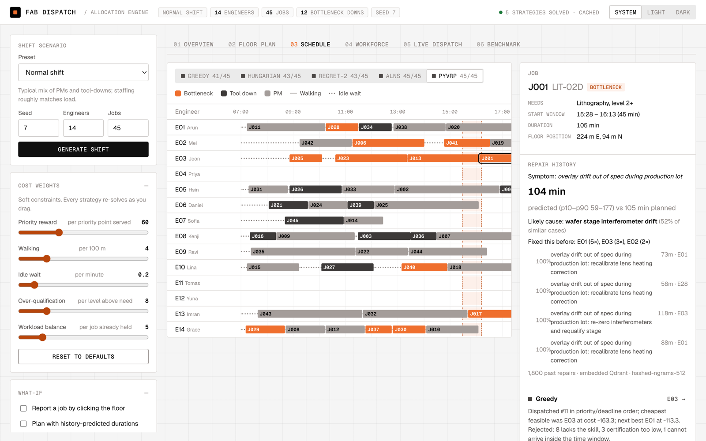
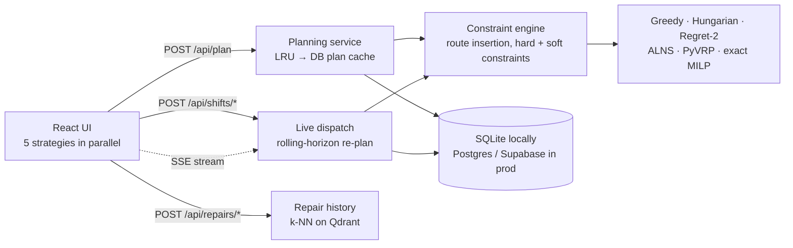

<div align="center">

# Fab Dispatch

**A resource allocation engine for semiconductor fab maintenance.**
Assigns equipment engineers to tool-downs and preventive maintenance in real time, comparing five
strategies from a one-pass greedy to a state-of-the-art vehicle-routing solver.

[](#quick-start)
[](backend/)
[](frontend/)
[](#testing)
[](#quick-start)

[**Live app**](https://fab-dispatch.vercel.app) · [Quick start](#quick-start) · [Results](#results) ·
[Architecture](docs/ARCHITECTURE.md) · [Algorithm analysis](docs/ANALYSIS.md) · [Decisions](docs/DECISIONS.md)


</div>

---

## Contents

- [Why this exists](#why-this-exists)
- [Highlights](#highlights)
- [Results](#results)
- [Quick start](#quick-start)
- [Screenshots](#screenshots)
- [How it works](#how-it-works)
- [API](#api)
- [Configuration](#configuration)
- [Testing](#testing)
- [Deployment](#deployment)
- [Project structure](#project-structure)
- [Documentation](#documentation)
- [Limitations and roadmap](#limitations-and-roadmap)

## Why this exists

When a lithography scanner goes down, every minute costs wafer moves. A shift lead has to decide,
right now, which engineer goes. That engineer has to be certified on the tool at the right level,
able to start within the response window, and not needed more urgently somewhere else, and the whole
floor has to stay covered for the rest of the shift.

Fab Dispatch models that decision as what it really is: a **technician routing and scheduling problem**
with skills, time windows and priorities. It solves it with five strategies, explains every
assignment, and recommends a plan using an explicit, statistically honest rule.

## Highlights

- **Five strategies, one engine.** Greedy, Hungarian (Kuhn-Munkres in rounds), regret-2 insertion,
  **ALNS**, and **PyVRP** iterated local search. All share one constraint engine and cost function, so
  comparisons are fair. An **exact MILP** solver measures each heuristic's true optimality gap.
- **Recommendations that refuse false positives.** The default "best value" goal never trades away
  bottleneck coverage. It treats cost differences inside a noise margin as ties and then picks the
  fastest plan. Benchmark verdicts use paired bootstrap 95% confidence intervals.
- **Every decision explained.** For any job you can see who was chosen, the runner-up, why other
  engineers were rejected (not certified, can't reach the window, at capacity), and the cost breakdown.
- **Live dispatch.** Tool-downs arrive as the shift runs. Started work is locked, the plan re-optimises
  in under a second with a stability penalty so people aren't reshuffled, and every open dashboard
  updates over **Server-Sent Events**. Share the link to watch from another device.
- **Repair-history intelligence.** A **Qdrant** vector index of past repairs predicts how long a new
  fault will take (with p10–p90), the likely root cause, and who has fixed it before.
- **Production engineering.** Deterministic solvers with a two-tier content-addressed plan cache, ETags,
  gzip, rate limits, request IDs, structured logs, optimistic concurrency, health checks, Docker, CI,
  and a Postgres store that runs on Supabase in production and on SQLite locally.

## Results

80 seeded shifts (4 scenario types × 20) of 14 engineers and 45 jobs, plus 20 small shifts solved to
proven optimality. Full tables and method in [docs/ANALYSIS.md](docs/ANALYSIS.md).

| Strategy | Kind | Solve time* | Lowest cost in | Mean gap to optimum | Strength |
|---|---|---|---|---|---|
| Greedy | constructive | ~2 ms | 0 / 80 | 10.5% | Instant, simplest to explain |
| Hungarian | assignment | ~3 ms | 0 / 80 | 7.2% | Fastest response to tool-downs, most even workload |
| Regret-2 | constructive | ~6 ms | 0 / 80 | 4.7% | Protects scarce certifications |
| ALNS | metaheuristic | ~0.2 s | 2 / 80 | **0.9%** | Optimises the exact objective, including balance |
| PyVRP | metaheuristic | ~0.4 s | **78 / 80** | 1.8% | Lowest operating cost at full scale |

\*Laptop, 14 engineers × 45 jobs. On Vercel's serverless CPU, ALNS and PyVRP take about 0.7–1.3 s.
A repeated plan is served from cache in under 1 ms of server time.

**What the comparison shows**
- Search beats one-pass rules: PyVRP is **23–30% cheaper** than the best constructive method in three of
  four scenario types, mostly by cutting idle wait by a third.
- Hungarian is the right choice when time-to-respond matters most. It is fastest to every tool-down,
  but builds up the most idle time.
- When certified engineers run out, every strategy hits the same ceiling. The workforce view says so:
  it's a staffing problem, not an algorithm one.

## Quick start

**Requirements:** Python 3.11+ and Node 20+. No accounts, API keys or Docker needed.

```bash
git clone https://github.com/pavansky/fab-dispatch.git
cd fab-dispatch
```

```bash
# Terminal 1: API on http://127.0.0.1:8000 (interactive docs at /docs)
cd backend
python3 -m venv .venv
source .venv/bin/activate        # Windows: .venv\Scripts\activate
pip install -r requirements.txt
uvicorn app.main:app --port 8000
```

```bash
# Terminal 2: UI on http://localhost:5173 (proxies /api to :8000)
cd frontend
npm install
npm run dev
```

Open **http://localhost:5173**. Locally the app stores state in SQLite (`backend/data/`, created on
first run) and builds its repair-history index in memory.

<details>
<summary><b>Other ways to run it</b></summary>

```bash
make setup && make dev           # both apps with one command
docker compose up --build        # production-like: Postgres + Qdrant + API + nginx on :8080
```

</details>

## Screenshots

<table>
<tr>
<td width="50%"><br/><sub><b>Floor plan.</b> Routes along fab aisles; the selected job shows its engineer's route, how each strategy handled it, and a repair-history prediction.</sub></td>
<td width="50%"><br/><sub><b>Schedule.</b> Every engineer's 12-hour shift with walking and idle wait, plus the selected job's start window.</sub></td>
</tr>
<tr>
<td width="50%"><br/><sub><b>Workforce.</b> Demand against certified supply per tool family. Shows when the constraint is staffing, not the algorithm.</sub></td>
<td width="50%"><br/><sub><b>Overview.</b> The recommended plan, the cost × latency frontier with its noise band, and scorecards against greedy.</sub></td>
</tr>
</table>

Every view has a shareable URL: `?tab=floor`, `?job=J001`, `?engineer=E03`, or `?shift=<id>` for a live shift.

## How it works



**The model.** Engineers start the shift at a home bay, hold certifications per tool family (litho,
etch, deposition, CMP, implant, metrology) at levels 1–3, and can take a limited number of jobs. Jobs
are tool-downs (tight response windows) or scheduled PMs, with a priority, a duration and a symptom.
Walking is Manhattan distance on the floor plan, because fab bays sit on a grid of aisles.

| | |
|---|---|
| **Hard constraints** (never violated; tested on every strategy) | certification, level, max jobs, start window, shift end |
| **Soft constraints** (one weighted cost, adjustable live) | walking, idle wait, over-qualification, workload balance, priority reward, stability (live mode) |

**The strategies** only decide *order and scope*; the engine scores everything. That's what makes the
comparison fair, and what lets PyVRP's routes be re-checked by the same rules as the others.
Details in [docs/ARCHITECTURE.md](docs/ARCHITECTURE.md).

## API

Interactive OpenAPI docs at **http://127.0.0.1:8000/docs**. Key endpoints:

| Method | Path | Purpose |
|---|---|---|
| `POST` | `/api/scenario` | Generate a seeded shift (4 presets) |
| `POST` | `/api/plan` | Plan with one strategy; cached by content (`X-Cache` header) |
| `POST` | `/api/benchmark` | All strategies over many seeded shifts of one preset |
| `POST` | `/api/optimality-gap` | Exact optimum vs every heuristic on small shifts |
| `POST` | `/api/shifts` | Start a live shift |
| `POST` | `/api/shifts/{id}/advance` · `/jobs` · `/engineers/{eid}/off` | Move the clock, report a tool-down, call off an engineer (`If-Match` for optimistic concurrency) |
| `GET` | `/api/shifts/{id}/stream` | Server-Sent Events; resumes with `Last-Event-ID` |
| `POST` | `/api/repairs/similar` | Similar past repairs, duration prediction, likely cause |
| `GET` | `/api/health` · `/api/livez` | Readiness (database) and liveness |

Errors share one envelope: `{"error": {"code", "message", "request_id"}}`.

## Configuration

Everything is optional; the defaults run locally with no setup. Variables use the `FAB_` prefix
(see [.env.example](.env.example)).

| Variable | Default | Purpose |
|---|---|---|
| `FAB_DATABASE_URL` | `sqlite:///./data/fab.db` | Postgres URL in production. `POSTGRES_URL` from Vercel's Supabase integration is also accepted |
| `FAB_QDRANT_URL`, `FAB_QDRANT_API_KEY` | unset (in-memory index) | Use a Qdrant server or Qdrant Cloud |
| `FAB_ALNS_ITERATIONS` / `FAB_PYVRP_ITERATIONS` | `300` / `1000` | Search budgets, sized from the measured quality curve |
| `FAB_SOLVER_TIME_LIMIT_S` | `3.0` | Safety cap per solve |
| `FAB_LIVE_TIME_LIMIT_S` | `0.6` | Cap per live re-plan |
| `FAB_SSE_WINDOW_S` | `25` | SSE responses close after this and browsers reconnect (serverless-safe) |
| `FAB_LOG_JSON`, `FAB_LOG_LEVEL` | `false`, `INFO` | Structured logs for production |

## Testing

```bash
cd backend && pip install -r requirements-dev.txt && pytest -q     # 143 tests
cd frontend && npm test                                            # 14 tests
cd backend && python -m scripts.benchmark --seeds 20               # regenerates docs/ANALYSIS.md tables
```

- **Hard constraints** are re-derived from scratch for every strategy across every scenario preset.
- **Optimality:** heuristics are checked against the exact MILP optimum and must never beat it.
- **API contract:** caching headers, ETag/304, error envelope, optimistic-concurrency conflicts, SSE replay.
- **Store contract** runs on SQLite and on real Postgres (`FAB_TEST_PG_URL`).
- **Frontend:** the recommendation logic, frontier detection and bootstrap statistics.

CI runs lint, the backend suite on Python 3.11, 3.12 and 3.14 against both SQLite and Postgres, the
frontend tests and build, and the Docker image builds.

## Deployment

| Target | How |
|---|---|
| **Local** | Quick start above: SQLite and an in-memory index, no configuration |
| **Docker** | `docker compose up --build`: Postgres 16, Qdrant, API (non-root, healthchecked) and nginx serving the UI on `:8080` |
| **Vercel + Supabase** | `vercel.json` defines two services (Vite UI and FastAPI API) on one domain. Connect a Supabase database through Vercel Storage; the app reads the injected `POSTGRES_URL`. Production runs at [fab-dispatch.vercel.app](https://fab-dispatch.vercel.app) with the database in the same region as the API |

Runbook, serverless behaviour and operations notes: [docs/DEPLOYMENT.md](docs/DEPLOYMENT.md).

## Project structure

```
backend/
  app/
    models.py              domain model (pydantic)
    planner.py             constraint engine: route simulation, insertion, live freezing
    algorithms/            greedy · hungarian · regret · alns · pyvrp_ils · exact
    engine.py              run a strategy -> assignments, explanations, metrics
    live.py                rolling-horizon live dispatch
    knowledge.py           repair history, embedder, Qdrant index
    services.py cache.py   two-tier plan cache
    store.py               SQLite / Postgres repository
    routes/                system · planning · live (SSE) · repairs
  scripts/benchmark.py     reproduces every table in docs/ANALYSIS.md
  tests/
frontend/src/
  App.jsx  api.js
  lib/                     recommendation logic, statistics, progressive planning hook
  components/              floor plan, frontier chart, schedule, workforce, live dispatch, benchmark
docs/                      ANALYSIS · ARCHITECTURE · DECISIONS · DEPLOYMENT · assets/
```

## Documentation

| Document | What's in it |
|---|---|
| [ANALYSIS.md](docs/ANALYSIS.md) | Full benchmark, optimality gaps, budget sizing, and when each strategy wins |
| [ARCHITECTURE.md](docs/ARCHITECTURE.md) | Components, request lifecycle, live dispatch, repair history, performance |
| [DECISIONS.md](docs/DECISIONS.md) | 16 design decisions with context and trade-offs |
| [DEPLOYMENT.md](docs/DEPLOYMENT.md) | Local, Docker and Vercel + Supabase runbook |
| [SECURITY.md](SECURITY.md) | Threat model and mitigations |
| [CHANGELOG.md](CHANGELOG.md) | Release history (v0.1.0 → v1.2.0) |

## Limitations and roadmap

- **Synthetic data.** Floor layout, SLAs, skill mix and repair history are illustrative and seeded for
  reproducibility. Real MES events and maintenance logs would plug into `Scenario`, `report_job` and
  `RepairIndex`.
- **Deterministic durations.** The repair-history range (p10–p90) is shown but not yet planned against;
  buffering to p80 would make schedules more robust.
- **One engineer per job; no parts availability.** Both are natural extensions of the constraint engine.
- **Authentication** is out of scope for this build; production would add SSO and dispatcher/viewer roles.
