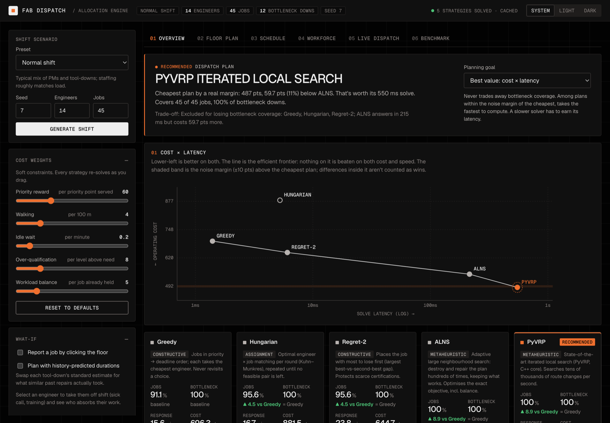
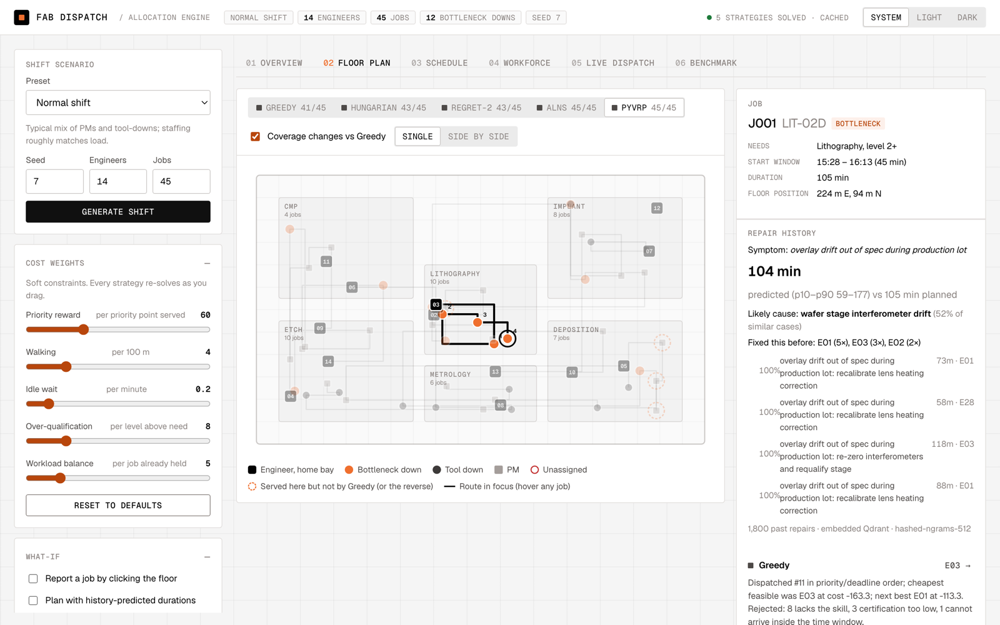
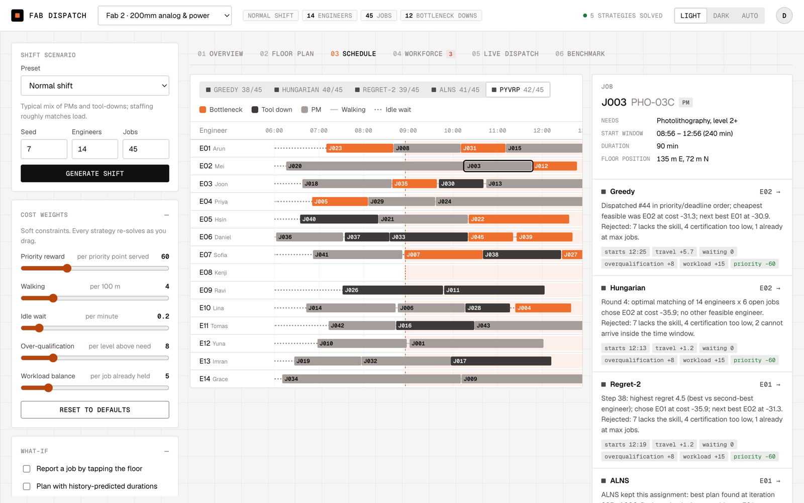
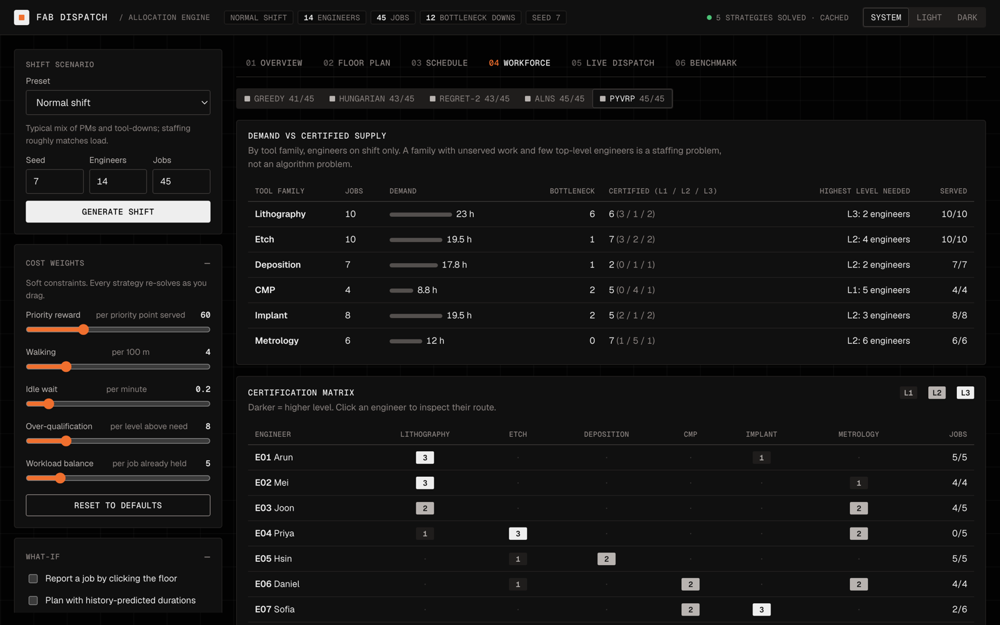
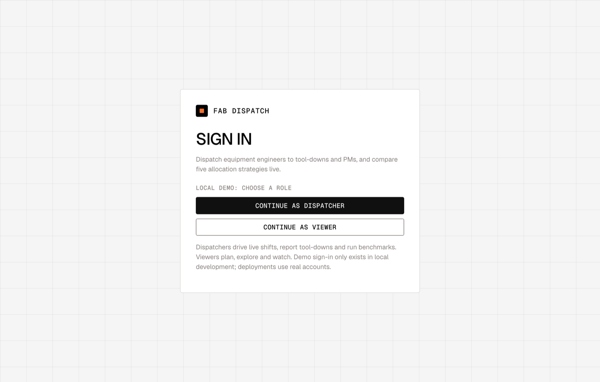
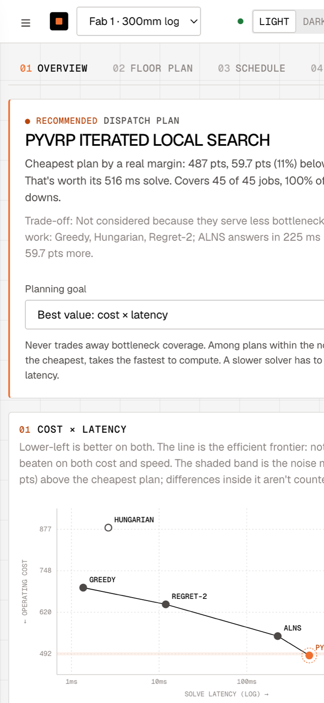
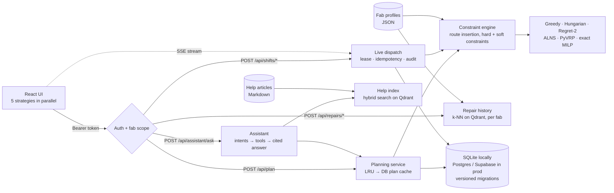

<div align="center">

# Fab Dispatch

**A resource allocation engine for semiconductor fab maintenance.**
Assigns equipment engineers to tool-downs and preventive maintenance in real time, across any number
of fabs, comparing five strategies from a one-pass greedy to a state-of-the-art vehicle-routing solver.

[](https://github.com/pavansky/fab-dispatch/actions/workflows/ci.yml)
[](#quick-start)
[](backend/)
[](frontend/)
[](#testing)
[](#testing)
[](#testing)
[](#quick-start)

[**Quick start**](#quick-start) · [**Live app**](https://fab-dispatch.vercel.app) · [5-minute tour](#a-5-minute-tour) · [Results](#results) ·
[Architecture](docs/ARCHITECTURE.md) · [Environments](docs/ENVIRONMENTS.md) · [Onboard a fab](docs/ONBOARDING_A_FAB.md) · [Analysis](docs/ANALYSIS.md)



</div>

---

## Contents

- [Quick start](#quick-start) · [A 5-minute tour](#a-5-minute-tour) · [Troubleshooting](#troubleshooting)
- [Why this exists](#why-this-exists)
- [Requirements map](#requirements-map)
- [Highlights](#highlights)
- [Results](#results)
- [Screenshots](#screenshots)
- [How it works](#how-it-works)
- [Multi-fab and access control](#multi-fab-and-access-control)
- [API](#api)
- [Configuration](#configuration)
- [Testing](#testing)
- [Delivery: dev → UAT → production](#delivery-dev--uat--production)
- [Project structure](#project-structure)
- [Documentation](#documentation)
- [Limitations and roadmap](#limitations-and-roadmap)

## Quick start

Runs entirely on your machine: no accounts, API keys, Docker or paid services. About three minutes
from clone to a working app, most of it package downloads.

**You need** Python **3.11–3.14** and Node.js **20.19+** (22 LTS recommended). Check with:

```bash
python3 --version && node --version
```

**1. Get the code**

```bash
git clone https://github.com/pavansky/fab-dispatch.git
cd fab-dispatch
```

**2. Start the API** (terminal 1, from the `fab-dispatch` folder)

```bash
cd backend
python3 -m venv .venv
source .venv/bin/activate
pip install -r requirements.txt
uvicorn app.main:app --port 8000
```

<details>
<summary>Windows (PowerShell)</summary>

```powershell
cd backend
py -m venv .venv
.venv\Scripts\Activate.ps1
pip install -r requirements.txt
uvicorn app.main:app --port 8000
```

</details>

Wait for `Uvicorn running on http://127.0.0.1:8000`. Optional check, from another terminal:
`curl http://127.0.0.1:8000/api/health` returns `{"status":"ok","db_ok":true,"schema_ok":true,...}`.

**3. Start the UI** (terminal 2, from the `fab-dispatch` folder)

```bash
cd frontend
npm install
npm run dev
```

**4. Open http://localhost:5173** and click **Continue as Dispatcher**. That's a local one-click
sign-in; the server refuses it in production. The first plan appears in about a second.

Locally the app stores data in SQLite (`backend/data/`, created on first run) and keeps the
repair-history index in memory. Interactive API docs are at http://127.0.0.1:8000/docs.

<details>
<summary><b>Other ways to run it</b></summary>

```bash
make setup && make dev           # both apps with one command (macOS / Linux)
make check                       # everything CI checks, locally
docker compose up --build        # production-like: Postgres + Qdrant + API + nginx on :8080
```

</details>

### Live app

https://fab-dispatch.vercel.app runs the same build on Vercel with Supabase (Postgres and Auth).

- **Try it as a guest:** one click, no email. Guests get full dispatcher access to the sample fabs.
- **Or sign in with your email:** a magic link or a 6-digit code (in a branded email), or a password.
  Named accounts start as **viewers**; an admin grants **dispatcher**.

Press **?** in the app for help, or **/** to ask the assistant.

## A 5-minute tour

1. **Overview.** The five strategies solve the same shift in parallel. The top card names the
   recommended plan and says why. The chart plots cost against solve time; the line is the efficient
   frontier. The scorecards below compare jobs served, bottleneck coverage, response, idle time and
   workload.
2. **Change the problem.** In the left panel, pick a preset (for example *Lithography crunch*), change
   engineers or jobs, and click **Generate shift**. Drag a **Cost weights** slider and every strategy
   re-solves.
3. **Floor plan** (the spatial view). Engineers, jobs and routes on the fab floor. Click a job to see
   who was assigned and why, the runner-up, why other engineers were rejected, and how each strategy
   handled it.
4. **Schedule** and **Workforce.** A timeline per engineer, and certified supply against demand per
   tool family. Workforce shows when the limit is staffing, not the algorithm.
5. **Benchmark.** Click **Run benchmark** to compare strategies over many seeded shifts, with 95%
   confidence intervals. **Measure gaps** solves small shifts exactly and shows each heuristic's
   distance from the proven optimum.
6. **Live dispatch.** Click **Start live shift**, then **Play** or **+1 h**. Turn on *Tap floor to
   report a bottleneck down* and click the floor: the plan re-optimises in under a second without
   reshuffling people. **Copy link** and open it in a second browser window: both update live.
7. **Another fab.** Switch to *Fab 2 · 200mm analog & power* in the top bar: a different floor, tool families
   and 8-hour shifts, all from a JSON profile.

## Troubleshooting

| Symptom | Fix |
|---|---|
| `npm run dev` fails with a syntax or engine error | Node is too old. Install Node 22 LTS. |
| `pip install` tries to compile numpy, scipy or pyvrp | Your Python is outside 3.11–3.14, or pip is old: `python -m pip install --upgrade pip` and retry. |
| *Can't reach the API. Is the backend running?* | Start the API (step 2). The UI proxies `/api` to port 8000. |
| `address already in use` on 8000 or 5173 | Another process holds the port. Stop it (`lsof -i :8000` on macOS/Linux), then restart. |
| **Run benchmark** or **Start live shift** is disabled | You're signed in as a viewer. Use the avatar menu to sign out, then **Continue as Dispatcher**. |
| You want a clean slate | Stop the API, delete `backend/data/`, start it again. |

## Why this exists

When a lithography scanner goes down, every minute costs wafer moves. A shift lead has to decide,
right now, which engineer goes. That engineer has to be certified on the tool at the right level,
able to start within the response window, and not needed more urgently somewhere else, and the whole
floor has to stay covered for the rest of the shift.

Fab Dispatch models that decision as what it really is: a **technician routing and scheduling problem**
with skills, time windows and priorities. It solves it with five strategies, explains every
assignment, and recommends a plan using an explicit, statistically honest rule. Every fab is
described by a data profile, so the same product serves any site.

## Requirements map

Where each part of a resource-allocation brief lives, in the app and in the code.

| Requirement | In the app | In the code |
|---|---|---|
| Data model: resources, requests, assignments | Left panel and every view | `backend/app/models.py` (`Engineer`, `Job`, `Assignment`, `Route`, `AllocationResult`) |
| At least two allocation algorithms | Five, side by side on **Overview** | `backend/app/algorithms/` (greedy, hungarian, regret, alns, pyvrp_ils, plus an exact MILP) |
| Hard and soft constraints | **Cost weights** sliders; rejections on **Floor plan** | `backend/app/planner.py` (one constraint engine for every strategy) |
| Decision explanations | Click any job on **Floor plan** | `backend/app/engine.py`, `algorithms/alns.py` |
| Meaningful metrics | Scorecards on **Overview**, tables on **Benchmark** | `backend/app/engine.py` (`_metrics`) |
| Tests and comparisons | (not in the UI) | `backend/tests/` (constraints, algorithms, optimality, API), `frontend/src/**/*.test.*` (components) and `frontend/e2e/` (Playwright) |
| Map / spatial view | **Floor plan** (SVG, no map service or keys) | `frontend/src/components/FloorPlan.jsx` |
| Algorithm comparison | **Overview** and **Benchmark** | `frontend/src/components/Overview.jsx`, `Benchmark.jsx` |
| Metrics display | **Overview**, **Benchmark**, **Workforce** | `frontend/src/components/MetricBars.jsx` |
| Interactive features (a plus) | Generate shifts, weights, what-if tool-downs, live dispatch, second fab | `frontend/src/components/Sidebar.jsx`, `LiveShift.jsx` |
| README and analysis | This file | [docs/ANALYSIS.md](docs/ANALYSIS.md) |
| React + FastAPI; free libraries only; runs locally without keys | Everything above | `frontend/package.json`, `backend/requirements.txt` |

## Highlights

- **Five strategies, one engine.** Greedy, Hungarian (Kuhn-Munkres in rounds), regret-2 insertion,
  **ALNS**, and **PyVRP** iterated local search. All share one constraint engine and cost function, so
  comparisons are fair. An **exact MILP** solver measures each heuristic's true optimality gap.
- **Recommendations that refuse false positives.** The default "best value" goal never trades away
  bottleneck coverage. It treats cost differences inside a noise margin as ties and then picks the
  fastest plan. Benchmark verdicts use paired bootstrap 95% confidence intervals.
- **Any fab, no code changes.** Floor plan, tool families, fault catalogue, shift pattern and planning
  presets live in a validated JSON profile. Two very different fabs ship today.
- **Secure and multi-tenant.** Supabase Auth in production (magic link or password), `viewer` and
  `dispatcher` roles, per-user fab access, and a one-click demo sign-in for local development.
- **Live dispatch for a whole team.** Tool-downs arrive as the shift runs. The plan re-optimises in
  under a second without reshuffling people, and every dashboard updates over **Server-Sent Events**.
  Production behaviours included: one clock driver at a time, retry-safe actions (idempotency keys),
  presence, an audit trail, recent shifts to rejoin, offline handling.
- **Every decision explained.** For any job you can see who was chosen, the runner-up, why other
  engineers were rejected, the cost breakdown, and a **repair-history** prediction (Qdrant) of how
  long the fault will take and who has fixed it before.
- **Help built in, and an assistant that cites its sources.** A searchable help center, contextual
  ⓘ links, a first-run tour and keyboard shortcuts. **Ask Dispatch** answers questions about the shift
  on screen ("why is J006 unassigned?") and the app, from the help articles and the real plans,
  always with sources. It says "I don't know" rather than guess: measured on an evaluation set in CI.
  Runs locally with no key; an LLM can optionally reword answers, never add facts.
- **Works on a phone.** The controls become a drawer, the tabs scroll, the floor plan works by touch,
  and the light theme is the default.
- **Tested at every layer.** 276 backend tests, 90 frontend component tests rendered against real API
  responses, and 25 Playwright end-to-end tests that drive the real app on desktop and on a phone.
- **Engineered for change.** Versioned database migrations, CI with coverage, security audits and a
  Postgres matrix, a release pipeline that promotes UAT-tested commits to production, and
  post-deploy smoke tests.

## Results

80 seeded shifts (4 scenario types × 20) of 14 engineers and 45 jobs, plus 20 small shifts solved to
proven optimality. Full tables and method in [docs/ANALYSIS.md](docs/ANALYSIS.md).

| Strategy | Kind | Solve time* | Lowest cost in | Mean gap to optimum | Strength |
|---|---|---|---|---|---|
| Greedy | constructive | ~2 ms | 0 / 80 | 10.5% | Instant, simplest to explain |
| Hungarian | assignment | ~3 ms | 0 / 80 | 7.2% | Fastest response to tool-downs, most even workload |
| Regret-2 | constructive | ~6 ms | 0 / 80 | 4.7% | Protects scarce certifications |
| ALNS | metaheuristic | ~0.2 s | 2 / 80 | **0.9%** | Optimises the exact objective, including balance |
| PyVRP | metaheuristic | ~0.4 s | **78 / 80** | 1.8% | Lowest operating cost at full scale |

\*Laptop, 14 engineers × 45 jobs. On Vercel's serverless CPU, ALNS and PyVRP take about 0.7–1.3 s.
A repeated plan is served from cache in under 1 ms of server time.

**What the comparison shows**
- Search beats one-pass rules: PyVRP is **23–30% cheaper** than the best constructive method in three of
  four scenario types, mostly by cutting idle wait by a third.
- Hungarian is the right choice when time-to-respond matters most. It is fastest to every tool-down,
  but builds up the most idle time.
- When certified engineers run out, every strategy hits the same ceiling. The workforce view says so:
  it's a staffing problem, not an algorithm one.

## Screenshots

<table>
<tr>
<td width="50%"><br/><sub><b>Floor plan.</b> Routes along fab aisles; the selected job shows its engineer's route, how each strategy handled it, and a repair-history prediction.</sub></td>
<td width="50%"><br/><sub><b>A second fab, no code changes.</b> Fab 2 runs 8-hour shifts from 06:00 with photolithography as its bottleneck, all from its profile.</sub></td>
</tr>
<tr>
<td width="50%"><br/><sub><b>Workforce.</b> Demand against certified supply per tool family. Shows when the constraint is staffing, not the algorithm.</sub></td>
<td width="50%"><br/><sub><b>Sign in.</b> Supabase Auth in UAT and production; one-click demo roles in local development.</sub></td>
</tr>
</table>

<p align="center"><br/><sub><b>On a phone.</b> Controls in a drawer, scrolling tabs, full-width recommendation.</sub></p>

Every view has a shareable URL: `?fab=fab2-200mm-analog`, `?tab=floor`, `?job=J001`, `?engineer=E03`,
or `?shift=<id>` for a live shift.

## How it works



**The model.** Engineers start the shift at a home bay, hold certifications per tool family at levels
1–3, and can take a limited number of jobs. Jobs are tool-downs (tight response windows) or scheduled
PMs, with a priority, a duration and a symptom. Walking is Manhattan distance on the floor plan,
because fab bays sit on a grid of aisles.

| | |
|---|---|
| **Hard constraints** (never violated; tested on every strategy and every fab) | certification, level, max jobs, start window, shift end |
| **Soft constraints** (one weighted cost, adjustable live) | walking, idle wait, over-qualification, workload balance, priority reward, stability (live mode) |

**The strategies** only decide *order and scope*; the engine scores everything. That's what makes the
comparison fair. Details in [docs/ARCHITECTURE.md](docs/ARCHITECTURE.md).

## Multi-fab and access control

- **Fab profiles** (`backend/app/fabs/profiles/*.json`) describe a site: floor, tool families with bay
  areas and tool-ID prefixes, fault catalogues, shift pattern and planning presets. They are validated
  at startup and in CI. Adding a fab is a JSON file: [docs/ONBOARDING_A_FAB.md](docs/ONBOARDING_A_FAB.md).
- **Roles:** `viewer` can plan, explore and watch live shifts. `dispatcher` can also drive the clock,
  report tool-downs, take engineers off shift and run benchmarks.
- **Fab access** comes from each user's Supabase `app_metadata` (admin-controlled). Requests for a fab
  outside a user's list return 404, so one customer can't discover another's.

## API

Interactive OpenAPI docs at **http://127.0.0.1:8000/docs**. Key endpoints:

| Method | Path | Role | Purpose |
|---|---|---|---|
| `GET` | `/api/auth/config` · `POST /api/auth/demo` · `GET /api/auth/me` | public / demo / user | How to sign in, local demo sign-in, current user |
| `GET` | `/api/fabs` · `/api/fabs/{id}` | viewer | Fabs you can access, and a fab's profile |
| `POST` | `/api/scenario` · `/api/plan` | viewer | Generate a shift for a fab; plan with one strategy (cached by content) |
| `POST` | `/api/benchmark` · `/api/optimality-gap` | dispatcher | Strategy comparison across seeded shifts; exact optimum vs heuristics |
| `POST` | `/api/shifts` · `/{id}/advance` · `/{id}/jobs` · `/{id}/engineers/{eid}/off` · `/{id}/release` | dispatcher | Run a live shift (`Idempotency-Key`, `If-Match`, clock lease) |
| `GET` | `/api/shifts?fab_id=` · `/{id}` · `/{id}/events` · `/{id}/stream` | viewer | Recent shifts, state (ETag), audit log, Server-Sent Events |
| `POST` | `/api/repairs/similar` · `/api/repairs/predict-durations` | viewer | Repair-history retrieval and duration prediction |
| `GET` | `/api/help` · `/api/help/{slug}` · `/api/help/search?q=` | public | Help center: contents, an article, search |
| `POST` | `/api/assistant/ask` | viewer | Grounded answer with citations and actions, for the shift sent as context |
| `GET` | `/api/health` · `/api/livez` | public | Readiness (database + schema version) and liveness |

Errors share one envelope: `{"error": {"code", "message", "request_id"}}`.

## Configuration

Everything is optional locally. Variables use the `FAB_` prefix (see [.env.example](.env.example)).

| Variable | Default | Purpose |
|---|---|---|
| `FAB_AUTH_MODE` | `demo` | `supabase` in UAT/production (demo is refused there) |
| `FAB_DISPATCHER_EMAILS`, `FAB_DEFAULT_ROLE`, `FAB_DEFAULT_FABS` | `[]`, `viewer`, `["*"]` | Bootstrap dispatchers, least-privilege default, default fab access |
| `FAB_DATABASE_URL` | `sqlite:///./data/fab.db` | Postgres in production. `POSTGRES_URL` from Vercel's Supabase integration is also accepted |
| `FAB_PROFILES_DIR`, `FAB_DEFAULT_FAB` | bundled, `fab1-300mm-logic` | Where fab profiles live; the fab shown first |
| `FAB_QDRANT_URL`, `FAB_QDRANT_API_KEY` | unset (in-memory index) | Use a Qdrant server or Qdrant Cloud |
| `FAB_ALNS_ITERATIONS` / `FAB_PYVRP_ITERATIONS` | `300` / `1000` | Search budgets, sized from the measured quality curve |
| `FAB_TURNSTILE_SITE_KEY` | unset | Cloudflare Turnstile site key, when CAPTCHA protection is on in Supabase Auth |
| `FAB_GUEST_ROLE` | `viewer` | Role for one-click guest sign-ins (Supabase anonymous users), or `none` to refuse guests |
| `FAB_ASSISTANT_LLM` | `none` | Optional model to reword assistant answers: `anthropic` (`ANTHROPIC_API_KEY`) or `ollama` (local) |
| `CRON_SECRET` | unset | Protects the daily data-retention endpoint |

## Testing

Three layers, all run in CI on every pull request:

| Layer | Tool | Count | What it proves |
|---|---|---|---|
| Backend | pytest | **276** (4 need Postgres) | Constraints, algorithms, optimality, API, auth, live dispatch, store, help, assistant quality |
| Frontend components | Vitest + Testing Library | **90** | Every view and flow, sign-in paths, help and the assistant, against **real API responses** |
| End-to-end | Playwright | **25** (20 desktop, 5 phone) | The real API and UI together in Chromium, including two browsers on one live shift |

Coverage: **94%** of the API (with Postgres, as CI measures it) and **88%** of the UI. CI fails below
90% for the API, or below the UI floors in `frontend/vite.config.js`.

```bash
# Backend (from backend/, with the virtualenv active)
pip install -r requirements-dev.txt
pytest

# Frontend unit and component tests (from frontend/)
npm test                      # or: npm run test:coverage

# End-to-end (from frontend/). Starts the API and UI by itself.
npx playwright install chromium   # once
npm run test:e2e
```

`make check` runs everything CI runs: lint, format, all three layers with coverage floors, dependency
audits and the frontend build. To include the Postgres tests locally, point `FAB_TEST_PG_URL` at any
Postgres database. To reproduce every table in [docs/ANALYSIS.md](docs/ANALYSIS.md), run
`python -m scripts.benchmark --seeds 20` from `backend/` (a few minutes).

**What the tests cover**
- **Hard constraints** re-derived from scratch for every strategy, on every preset of **every fab**.
- **Optimality:** heuristics checked against the exact MILP optimum, and never allowed to beat it.
- **Fab 1 golden test:** converting the hard-coded fab into a profile reproduces its scenarios byte for byte.
- **Auth:** 401 without a token, forged and expired tokens rejected, 403 for viewers on dispatcher
  actions (in the API and in the browser), 404 across fabs, demo mode refused in production.
- **Real-time:** idempotent retries, clock lease conflicts, presence, audit trail; in the browser, a
  viewer in a second window watching a dispatcher's changes arrive over Server-Sent Events.
- **UI against real data:** components render JSON captured from the API
  (`backend/scripts/export_ui_fixtures.py`). A backend test fails if the API's response shape drifts
  from those fixtures, so the UI tests can't pass against stale data (`make fixtures` refreshes them).
- **Phone layout:** the drawer, touch selection, no sideways scrolling on any view, and the user menu
  staying reachable.
- **Assistant quality:** an evaluation set of real questions must cite the right article (≥ 90%; 100%
  today), and every off-topic question must get "I don't know". Answers about a job match the plans
  exactly. The optional LLM is tested to fall back to the grounded answer on any failure.
- **Every end-to-end test fails on any browser console error.**

## Delivery: dev → UAT → production

| | Dev | UAT | Production |
|---|---|---|---|
| Deploys | locally / every pull request (preview) | every merge to `main` | a release tag `vX.Y.Z` |
| Access | demo sign-in | Vercel login + Supabase Auth | Supabase Auth |
| Database | SQLite / schema `uat` | Supabase, schema `uat` | Supabase, schema `public` |

- **Branch protection:** `main` only accepts changes that pass CI; `production` can't be force-pushed
  or deleted, and only moves forward through a release.
- **CI** on every push and PR: ruff lint and format, API tests with a 90% coverage floor (Postgres
  included), Python 3.11/3.12/3.14, Postgres migrations, ESLint, component tests with coverage floors,
  Playwright end-to-end on desktop and phone, build, `pip-audit` + `npm audit`, Docker images.
- **Release:** pushing a tag re-runs CI on that exact commit, requires it to be on `main` (UAT-tested),
  fast-forwards the `production` branch, and publishes release notes from the changelog.
- **Smoke tests** after every deployment: healthy, schema current, real auth (never demo).
- **Rollback:** promote the previous deployment in Vercel; migrations are additive so it keeps working.

Runbook: [docs/ENVIRONMENTS.md](docs/ENVIRONMENTS.md) · Hosting details: [docs/DEPLOYMENT.md](docs/DEPLOYMENT.md).

## Project structure

```
backend/
  app/
    fabs/                  fab profile schema, registry, profiles/*.json
    auth.py validation.py  identity, roles, fab scoping
    models.py              domain model (pydantic)
    planner.py             constraint engine: route simulation, insertion, live freezing
    algorithms/            greedy · hungarian · regret · alns · pyvrp_ils · exact
    engine.py              run a strategy -> assignments, explanations, metrics
    live.py                rolling-horizon live dispatch, clock lease
    knowledge.py           repair history and Qdrant index, per fab
    help/                  help center articles (Markdown) and their validation
    assistant/             grounded assistant: retrieval, intents and tools, optional LLM
    store.py               SQLite / Postgres repository + versioned migrations
    routes/                system · auth · fabs · planning · live (SSE) · repairs
  scripts/benchmark.py     reproduces every table in docs/ANALYSIS.md
  scripts/export_ui_fixtures.py   real API responses for the UI tests
  tests/                   276 tests (incl. golden fab fingerprints, UI fixture contract, assistant eval)
frontend/src/
  App.jsx auth.jsx api.js  workspace, sign-in, API client
  lib/                     fab context, recommendation logic, statistics, progressive planning
  components/              floor plan, frontier chart, schedule, workforce, live dispatch, benchmark
  components/HelpCenter · Assistant · Tour   in-app help, Ask Dispatch, first-run tour
  test/                    fake API over real fixtures, app-level, live-dispatch, help and sign-in tests
frontend/e2e/              Playwright: planning, live dispatch, roles and fabs, help and assistant, phone
supabase/                  branded auth email templates and how to apply them
.github/                   CI, release and smoke workflows, Dependabot, templates, CODEOWNERS
docs/                      ANALYSIS · ARCHITECTURE · DECISIONS · DEPLOYMENT · ENVIRONMENTS · ONBOARDING_A_FAB
```

## Documentation

| Document | What's in it |
|---|---|
| [ANALYSIS.md](docs/ANALYSIS.md) | Benchmark, optimality gaps, budget sizing, when each strategy wins |
| [ARCHITECTURE.md](docs/ARCHITECTURE.md) | Components, auth and tenancy, live dispatch, repair history, migrations, performance |
| [DECISIONS.md](docs/DECISIONS.md) | 25 design decisions with context and trade-offs |
| [ENVIRONMENTS.md](docs/ENVIRONMENTS.md) | Dev → UAT → production, releases, rollback, per-environment config |
| [ONBOARDING_A_FAB.md](docs/ONBOARDING_A_FAB.md) | Adding a new fab: profile, validation, access, release |
| [DEPLOYMENT.md](docs/DEPLOYMENT.md) | Local, Docker and Vercel + Supabase hosting |
| [CONTRIBUTING.md](CONTRIBUTING.md) | Setup, conventions, migrations, releasing |
| [In-app help](backend/app/help/articles/) | The 16 help-center articles, readable here too |
| [supabase/README.md](supabase/README.md) | Branded sign-in emails, sender setup, guest access |
| [SECURITY.md](SECURITY.md) | Threat model and mitigations |
| [CHANGELOG.md](CHANGELOG.md) | Release history (v0.1.0 → v2.1.0) |

## Limitations and roadmap

- **Synthetic data.** Floor layouts, SLAs, skill mixes and repair histories are illustrative and seeded
  for reproducibility. Real MES events and maintenance logs would plug into `Scenario`, `report_job`
  and `RepairIndex`.
- **Deterministic durations.** The repair-history range (p10–p90) is shown but not yet planned against;
  buffering to p80 would make schedules more robust.
- **One engineer per job; no parts availability.** Both are natural extensions of the constraint engine.
- **Enterprise SSO** (SAML/OIDC via Supabase) and **audit export** to a fab's SIEM are configuration
  and integration work, not redesign.
