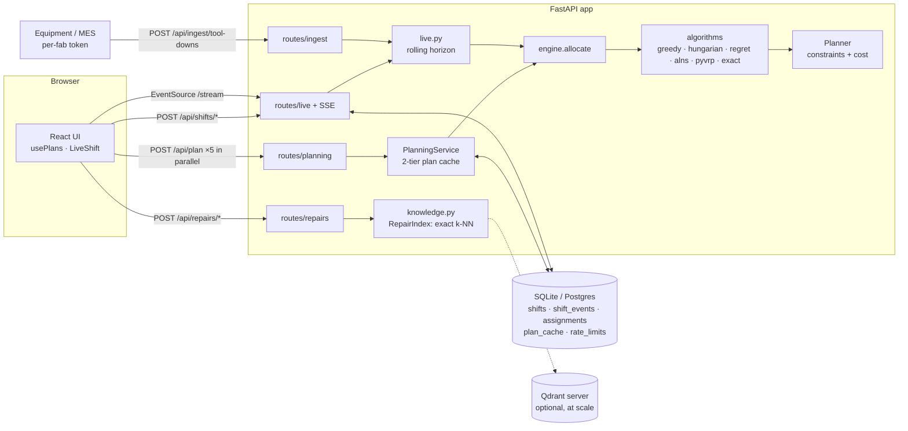
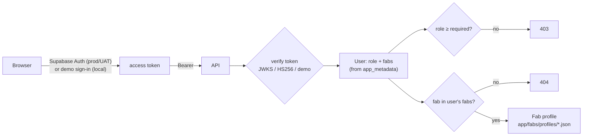
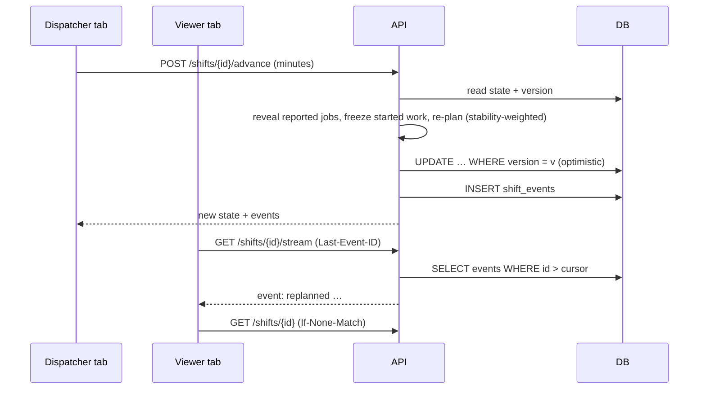

# Architecture

## 1. Overview

One FastAPI app, stateless between requests. All durable state lives in the store, so any number of
instances (or serverless invocations) can serve the same users.

## 2. Fabs, users and tenancy

- **Fab profiles** hold everything site-specific: floor, tool families with bay areas, tool-ID
  prefixes, fault catalogues, shift pattern and planning presets. They are validated at startup. The
  generator, repair history (one Qdrant collection per fab), API and UI all read them, so onboarding
  a fab is a JSON file ([ONBOARDING_A_FAB.md](ONBOARDING_A_FAB.md)).
- **Identity**: `app/auth.py`. Supabase-issued tokens are verified against the project's JWKS
  (ES256/RS256) or the legacy HS256 secret, with issuer and audience checks. Local development
  uses short-lived demo tokens, which settings refuse in production.
- **Authorisation**: `viewer` (plan, explore, watch) < `dispatcher` (drive live shifts, report
  tool-downs, call engineers off, run benchmarks). Fab access comes from `app_metadata.fabs`, and
  requests outside it return 404.

## 3. The core: one constraint engine, many strategies

`app/planner.py` is the only place that knows the rules. It simulates each engineer's route from the
home bay (or from where locked live work leaves them), and answers two questions:

- `best_insertion(engineer, job)`: the cheapest feasible position in that route, with a per-term cost
  breakdown, or the first hard constraint that rules it out (`skill_missing`, `level_too_low`,
  `at_capacity`, `window_missed`, `shift_overrun`). Results are cached per (engineer, job) and
  invalidated only for the engineer whose route changed.
- `total_cost()`: the full objective. Route soft costs, the convex workload term, the reassignment
  penalty in live mode, and the reward forgone for each unserved job.

The algorithms only decide **order and scope**:

| Strategy | Uses the planner by… |
|---|---|
| Greedy | one `scan` per job in priority/deadline order |
| Hungarian | a matrix of `best_insertion` costs per round, solved by `scipy.optimize.linear_sum_assignment` |
| Regret-2 | each step, the job with the largest gap between its best and second-best insertion |
| ALNS | `remove` / `snapshot` / `restore` plus the greedy and regret repairs, accepting on `total_cost` |
| PyVRP | translating the instance into PyVRP's model, then replaying its routes through `append`, so every number comes from our engine |
| Exact | enumerating feasible routes with the planner's simulator, then choosing a set by MILP |

So a result from any strategy is measured identically, and the hard-constraint tests in
`tests/test_constraints.py` re-derive every route's timing from scratch.

## 4. Request lifecycle: planning

1. The browser issues five `POST /api/plan` calls (one per strategy) in parallel. A newer input aborts
   older requests (`AbortController`), and a browser-side LRU answers repeats with no network.
2. `PlanningService.plan` hashes `(scenario, weights, algorithm, solver budget, ENGINE_VERSION)` and
   checks the in-process LRU, then the `plan_cache` table, then solves.
3. Solvers are deterministic: fixed seeds and **iteration** budgets, with the time limit only as a
   safety cap. A result that hit the cap isn't reproducible, so it isn't written to the shared cache.
4. The response carries `X-Cache` (`memory`/`store`/`miss`) and `Server-Timing`.

## 5. Live dispatch

- **Server-owned clock, client-driven.** The browser asks the server to advance. Nothing has to run
  between requests, which is what serverless needs. Closing the tab simply pauses the shift.
- **Rolling horizon.** Only jobs reported so far are planned. Work with `start ≤ clock` is frozen on
  its engineer (`Frozen` in the planner), and new work can't start before the clock.
- **Stability.** Moving a job away from the engineer who held it costs `Weights.stability`, so a new
  tool-down disturbs as few people as possible.
- **Concurrency.** Every write is `UPDATE … WHERE version = expected`. The server retries a lost race;
  a client that sent `If-Match` gets a 409 instead of a silent overwrite.
- **One clock driver.** Advancing the clock takes a 20 s lease, renewed on each tick and released on
  pause, so two dispatchers can't run the shift at double speed.
- **Idempotency.** Mutating live calls carry an `Idempotency-Key`; a retry returns the stored first
  response instead of applying the change again.
- **Presence and audit.** Open SSE streams heartbeat who is watching; every event records its actor.
- **Fan-out.** The event log is the source of truth. SSE tails it by id, so reconnects resume exactly
  where they left off and any instance can serve any viewer. Each SSE response closes after
  `FAB_SSE_WINDOW_S` (25 s) to stay inside serverless limits, and `EventSource` reconnects by itself.
  Polling backs off while a shift is quiet (0.25 s → 2 s) and snaps back on the next event.
- **Read model.** The shift document is the write model; every write also replaces the shift's rows
  in `assignments` (engineer, times, status per job) **in the same transaction**. Questions about the
  domain, such as an engineer's history across shifts, are indexed queries, not document scans.
- **Ingestion.** Equipment systems post tool-downs to `POST /api/ingest/tool-downs` with a per-fab
  token (only its SHA-256 is configured) and a required `Idempotency-Key`, since integrations deliver
  at least once. The fault joins the fab's live shift and is re-planned like any other.

## 6. Repair history (Qdrant)

`knowledge.py` holds a seeded catalogue of fault codes per tool family. Each code has root causes with
their own repair-time distributions, giving 1,800 past repairs. Each repair's symptom is embedded
(hashed word and character-trigram features, 512-d, L2-normalised: no model download) and indexed in
Qdrant with the family as payload.

For a new tool-down: filter by family, take the top 12 neighbours by cosine similarity, then predict
duration as a similarity²-weighted mean with a p10–p90 range. The likely root cause comes from a
weighted vote, and the most frequent fixers are listed. This is k-NN regression, so every prediction
can be traced back to the neighbours that produced it.

Search is **exact** by default: the vectors are normalised, so cosine similarity is one NumPy matrix
product. At 1,800 repairs per fab that's ~0.1 ms per query and an 80 ms build on first use, with no
vector database to run. Ties break by repair id, so answers are reproducible. Real history grows into
the millions; `FAB_QDRANT_URL` moves the same interface onto a Qdrant server with approximate (HNSW)
search, and `FAB_QDRANT_PATH` keeps an embedded on-disk Qdrant for experiments.

## 7. Configuration and migrations

`app/config.py`: one `Settings` (pydantic-settings, prefix `FAB_`, `.env` supported). Every value has a
working default, so a fresh clone runs with no configuration. On Vercel (`VERCEL` set) the defaults
move to `/tmp` and logs switch to JSON. See [.env.example](../.env.example).

Schema changes are numbered, append-only migrations (`MIGRATIONS` in `app/store.py`), recorded in
`schema_migrations` and applied at startup under a Postgres advisory lock. `/api/health` reports
`schema_ok`. Environments and promotion: [ENVIRONMENTS.md](ENVIRONMENTS.md).

## 8. Performance (measured, M-series laptop)

| Operation | Time |
|---|---|
| Greedy / Hungarian / Regret, 14 × 45 | 1–7 ms |
| ALNS (300 it.), 14 × 45 | ~0.17 s (≈0.9 s on Vercel) |
| PyVRP (1000 it.), 14 × 45 | ~0.4 s (≈1 s on Vercel) |
| Repeated plan, production (cache hit) | < 1 ms server time |
| Same plan from the in-process cache | ~3 ms end to end through nginx |
| Live re-plan with ALNS | ~100 ms |
| Repair-history query | ~0.1 ms (index build ~80 ms, once) |

Full solver numbers are in [ANALYSIS.md](ANALYSIS.md).

## 9. Repo map

| Path | Responsibility |
|---|---|
| `app/fabs/` | fab profile schema, registry and the profile JSON files |
| `app/auth.py`, `app/validation.py` | identity, roles, fab scoping, scenario checks against a profile |
| `app/models.py` | pydantic domain model and validation |
| `app/planner.py` | constraint engine (section 2) |
| `app/algorithms/*` | the six solvers |
| `app/engine.py` | run a solver, then build assignments, explanations and metrics |
| `app/live.py` | live shift state machine |
| `app/knowledge.py` | repair history, embedder, Qdrant index |
| `app/services.py`, `app/cache.py` | plan cache |
| `app/store.py` | `Store` interface with SQLite and Postgres implementations |
| `app/routes/*` | HTTP surface |
| `app/observability.py`, `app/http.py` | logging, request IDs, security headers, rate limiting, ETags |

## 10. Design principles, trade-offs, and what changes at fab scale

### Principles this design follows

| Principle | Where it shows |
|---|---|
| **Stateless compute, state in one place** | Any instance serves any request; shifts, events, caches and quotas live in the store. |
| **The log is the truth** | `shift_events` is append-only; streams resume by id; the audit trail survives account deletion. |
| **Separate writes from reads (CQRS)** | The shift document is written with an optimistic version; `assignments` is projected from it in the same transaction for queries. |
| **Make retries safe** | Idempotency keys on every mutating live call, required for integrations. |
| **Defence in depth** | Fab scope is checked in SQL *and* in the route; app tables are closed to Supabase's public API and checked after every deploy. |
| **Degrade, don't fail** | The shared rate limit fails open; a locked Qdrant folder falls back to memory; capped solves aren't cached. |
| **Deterministic where possible** | Fixed seeds and iteration budgets make plans cacheable by content hash, and repair search breaks ties by id. |
| **Simplest thing that holds at this scale** | Exact search instead of a vector database; Postgres polling instead of a message broker, with the next step named below. |

### Deliberate trade-offs, and the next step for each

| Today | Why it's right here | At a real fab's scale |
|---|---|---|
| Solves run inside the request (threadpool), ~1 s on Vercel | 14 × 45 jobs solve well inside any limit; no queue to operate | A job queue (e.g. Postgres `SKIP LOCKED` or a managed queue) with workers; `202 Accepted` plus progress over the existing event stream |
| Live updates by adaptive polling of the event log | Works on serverless with no extra service; ~2 queries/s per busy viewer, 0.5/s idle | Postgres `LISTEN/NOTIFY` on long-lived workers, or Supabase Realtime on the events table with per-fab policies |
| Shift state is one JSON document, rewritten per write | One atomic, version-checked write; simple to re-plan | Keep it as the write model, store only the diff per event, and snapshot every N events |
| Fab isolation in SQL and in code, one database role | One service role is simple to reason about | Row-level security policies keyed by a per-request fab claim, so the database enforces isolation even against a bug |
| UAT and production share a Supabase project (separate schemas) | Free tier: one project | One project per environment, so a UAT incident can't touch production |
| Durations are point estimates | Repair history already gives p10–p90 | Plan against a chosen quantile (e.g. p80) per job, or robust/stochastic optimisation across scenarios |
| Ingestion pushes into the live shift | The integration point exists and is safe to retry | A durable inbox table between ingestion and planning, so a burst of faults queues instead of contending for the shift |

