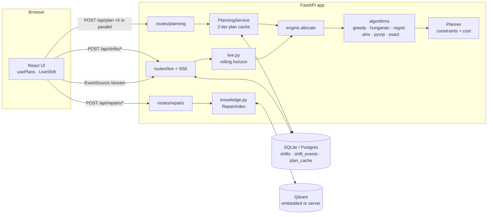
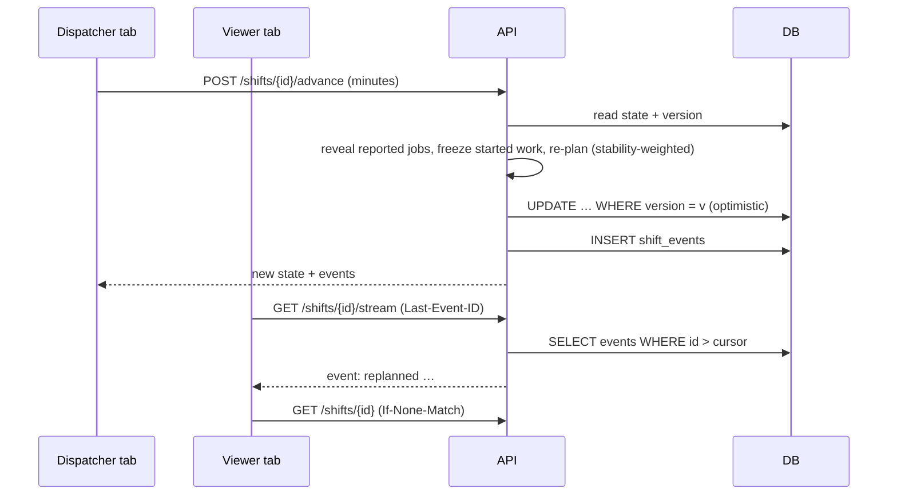

# Architecture

## 1. Overview

One FastAPI app, stateless between requests. All durable state lives in the store, so any number of
instances (or serverless invocations) can serve the same users.

## 2. The core: one constraint engine, many strategies

`app/planner.py` is the only place that knows the rules. It simulates each engineer's route from the
home bay (or from where locked live work leaves them), and answers two questions:

- `best_insertion(engineer, job)`: the cheapest feasible position in that route, with a per-term cost
  breakdown, or the first hard constraint that rules it out (`skill_missing`, `level_too_low`,
  `at_capacity`, `window_missed`, `shift_overrun`). Results are cached per (engineer, job) and
  invalidated only for the engineer whose route changed.
- `total_cost()`: the full objective. Route soft costs, the convex workload term, the reassignment
  penalty in live mode, and the reward forgone for each unserved job.

The algorithms only decide **order and scope**:

| Strategy | Uses the planner by… |
|---|---|
| Greedy | one `scan` per job in priority/deadline order |
| Hungarian | a matrix of `best_insertion` costs per round, solved by `scipy.optimize.linear_sum_assignment` |
| Regret-2 | each step, the job with the largest gap between its best and second-best insertion |
| ALNS | `remove` / `snapshot` / `restore` plus the greedy and regret repairs, accepting on `total_cost` |
| PyVRP | translating the instance into PyVRP's model, then replaying its routes through `append`, so every number comes from our engine |
| Exact | enumerating feasible routes with the planner's simulator, then choosing a set by MILP |

So a result from any strategy is measured identically, and the hard-constraint tests in
`tests/test_constraints.py` re-derive every route's timing from scratch.

## 3. Request lifecycle: planning

1. The browser issues five `POST /api/plan` calls (one per strategy) in parallel. A newer input aborts
   older requests (`AbortController`), and a browser-side LRU answers repeats with no network.
2. `PlanningService.plan` hashes `(scenario, weights, algorithm, solver budget, ENGINE_VERSION)` and
   checks the in-process LRU, then the `plan_cache` table, then solves.
3. Solvers are deterministic: fixed seeds and **iteration** budgets, with the time limit only as a
   safety cap. A result that hit the cap isn't reproducible, so it isn't written to the shared cache.
4. The response carries `X-Cache` (`memory`/`store`/`miss`) and `Server-Timing`.

## 4. Live dispatch

- **Server-owned clock, client-driven.** The browser asks the server to advance. Nothing has to run
  between requests, which is what serverless needs. Closing the tab simply pauses the shift.
- **Rolling horizon.** Only jobs reported so far are planned. Work with `start ≤ clock` is frozen on
  its engineer (`Frozen` in the planner), and new work can't start before the clock.
- **Stability.** Moving a job away from the engineer who held it costs `Weights.stability`, so a new
  tool-down disturbs as few people as possible.
- **Concurrency.** Every write is `UPDATE … WHERE version = expected`. The server retries a lost race;
  a client that sent `If-Match` gets a 409 instead of a silent overwrite.
- **Fan-out.** The event log is the source of truth. SSE tails it by id, so reconnects resume exactly
  where they left off and any instance can serve any viewer. Each SSE response closes after
  `FAB_SSE_WINDOW_S` (25 s) to stay inside serverless limits, and `EventSource` reconnects by itself.

## 5. Repair history (Qdrant)

`knowledge.py` holds a seeded catalogue of fault codes per tool family. Each code has root causes with
their own repair-time distributions, giving 1,800 past repairs. Each repair's symptom is embedded
(hashed word and character-trigram features, 512-d, L2-normalised: no model download) and indexed in
Qdrant with the family as payload.

For a new tool-down: filter by family, take the top 12 neighbours by cosine similarity, then predict
duration as a similarity²-weighted mean with a p10–p90 range. The likely root cause comes from a
weighted vote, and the most frequent fixers are listed. This is k-NN regression, so every prediction
can be traced back to the neighbours that produced it.

Modes: in-memory per process by default (any number of workers, no file locks), optional on-disk via
`FAB_QDRANT_PATH` (falls back to memory if another process holds the lock), and a server via
`FAB_QDRANT_URL` in compose or production. The index is built idempotently on first use (about 0.6 s).

## 6. Configuration

`app/config.py`: one `Settings` (pydantic-settings, prefix `FAB_`, `.env` supported). Every value has a
working default, so a fresh clone runs with no configuration. On Vercel (`VERCEL` set) the defaults
move to `/tmp` and logs switch to JSON. See [.env.example](../.env.example).

## 7. Performance (measured, M-series laptop)

| Operation | Time |
|---|---|
| Greedy / Hungarian / Regret, 14 × 45 | 1–7 ms |
| ALNS (300 it.), 14 × 45 | ~0.17 s (≈0.9 s on Vercel) |
| PyVRP (1000 it.), 14 × 45 | ~0.4 s (≈1 s on Vercel) |
| Repeated plan, production (cache hit) | < 1 ms server time |
| Same plan from the in-process cache | ~3 ms end to end through nginx |
| Live re-plan with ALNS | ~100 ms |
| Repair-history query | ~7 ms (index build ~0.6 s, once) |

Full solver numbers are in [ANALYSIS.md](ANALYSIS.md).

## 8. Repo map

| Path | Responsibility |
|---|---|
| `app/models.py` | pydantic domain model and validation |
| `app/planner.py` | constraint engine (section 2) |
| `app/algorithms/*` | the six solvers |
| `app/engine.py` | run a solver, then build assignments, explanations and metrics |
| `app/live.py` | live shift state machine |
| `app/knowledge.py` | repair history, embedder, Qdrant index |
| `app/services.py`, `app/cache.py` | plan cache |
| `app/store.py` | `Store` interface with SQLite and Postgres implementations |
| `app/routes/*` | HTTP surface |
| `app/observability.py`, `app/http.py` | logging, request IDs, security headers, rate limiting, ETags |
