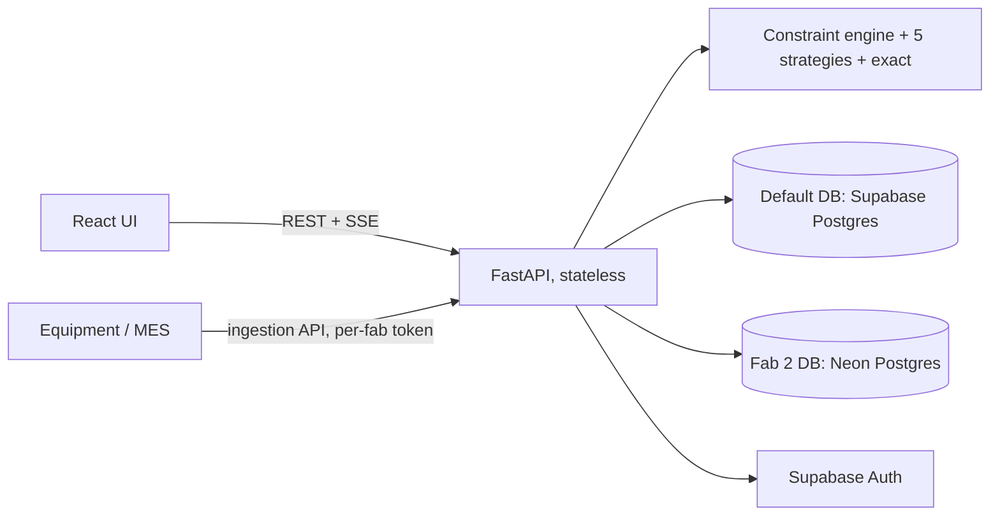

# Design review: questions and answers

Everything a reviewer or interviewer is likely to ask about Fab Dispatch, answered in one place,
with the number behind each claim and where to find it. Sections follow the order a technical
discussion usually takes: the problem, the model, the algorithms, the evidence, the system, and the
trade-offs.

Every figure here is measured and reproducible. The scripts are named next to the results.

---

## 0. The short version

**In one sentence.** A resource allocation engine for semiconductor fab maintenance: it assigns
certified equipment engineers to tool-downs and preventive maintenance, compares five allocation
strategies on the same constraint engine, explains every decision, and runs live as faults arrive.

**In one minute.**

- **The problem.** When a tool goes down in a fab, the shift lead has to pick the engineer who is
  certified at the right level, can start inside the response window, and isn't needed more urgently
  elsewhere, while keeping the whole floor covered. That is a technician routing and scheduling
  problem with skills, time windows and priorities, not a one-to-one matching.
- **The solution.** One constraint engine scores every strategy identically: greedy, Hungarian in
  rounds, regret-2, adaptive large neighbourhood search (ALNS) and PyVRP. An exact solver proves the
  true optimum on all 80 full-size benchmark shifts.
- **The results.** PyVRP is 2.7% from the proven optimum on average and the cheapest plan in 78 of
  80 shifts. The rules a dispatcher would use by hand are 19–28% from optimal.
- **The system.** React and FastAPI, live dispatch over server-sent events, Supabase sign-in, a
  database per fab (fab 2's data lives in its own Neon database in production), and a CI/CD pipeline
  with 15 required checks. The live demo is at https://fab-dispatch.vercel.app (guest access).

**In two minutes, add the three things that make it more than a homework solution:**

1. **The comparison is fair and measured.** Every strategy is scored by the same code, and every gap
   is measured against a proven optimum rather than against the best heuristic.
2. **The recommendation refuses false positives.** A slower solver has to beat the cheapest plan by
   more than the noise margin to be recommended, and the benchmark only calls a difference real when
   a paired bootstrap confidence interval excludes zero.
3. **The scaling claim is measured.** A 20,000-engineer organisation re-plans in 47 s on one laptop
   because the problem decomposes by fab, skill and area, and a live tool-down re-plans in about
   200 ms.

---

## 1. Problem framing

### What was the brief?
A resource allocation engine: a data model for resources, requests and assignments; at least two
allocation algorithms; hard and soft constraints; explanations for decisions; meaningful metrics;
tests and comparisons; and a web UI with a spatial view, algorithm comparison and metrics. React
and FastAPI, free libraries only, runnable locally with no keys. The
[requirements map](https://github.com/pavansky/fab-dispatch#requirements-map) in the README shows
where each item lives in the app and in the code.

### Why semiconductor fab maintenance?
It's a domain where allocation decisions are expensive and constrained in ways that make the
algorithms matter. A down lithography scanner can cost tens of thousands of dollars of wafer moves
per hour. Engineers are certified per tool family at levels 1–3, and the scarcest certifications
(litho level 3) are held by a handful of people per shift. It is also directly relevant to an
industrial AI company that works on equipment reliability.

### Why isn't this a simple one-to-one assignment?
Because an engineer does 4–6 jobs in a shift, and the **order** decides whether later time windows
are reachable. Assigning job A to an engineer changes when they can start job B. So each engineer
needs an ordered route, which makes this a vehicle routing problem with time windows (VRPTW) with
skills, known in the literature as the technician routing and scheduling problem (TRSP). Decision
D1 records this.

### What are the assumptions?

| Assumption | Why it's reasonable | Where it's encoded |
|---|---|---|
| Walking is Manhattan distance on the floor plan | Fab bays are a grid of aisles; you can't cut across tools | `planner.py`, D3 |
| Walking speed 60 m/min | Cleanroom garb slows people down | `models.Settings` |
| One engineer per job | True for most fab maintenance; two-person jobs are a stated extension | Limitations |
| A job must **start** inside its window | Response targets are about starting work | `planner._simulate` |
| Durations are known point estimates | Repair history gives a p10–p90 range; planning against it is the next step | D33 |
| Engineers start at a home bay and have a shift end and a job cap | How shifts work | `models.Engineer` |
| Data is synthetic | No real fab data is available; the generator is seeded and structured so the problem has real signal | `generator.py` |

### What is synthetic, and does that undermine the results?
The fabs, engineers, jobs and repair history are generated from seeded profiles. The **comparison
between methods** doesn't depend on the data being real: all five strategies solve the same
instances, and the exact optimum is computed on those same instances. What would change with real
data is the absolute cost, not which method is closer to optimal. The generator is deliberately
structured (fault codes have root causes with their own duration distributions; presets vary the
skill scarcity and fault mix) so the problem isn't random noise.

### What scenarios are tested?
Four presets per fab, each with a reason to exist:

| Preset | What it stresses |
|---|---|
| Normal shift | Typical mix of PMs and tool-downs; staffing roughly matches load |
| Lithography crunch | Scanner problems pile up while few engineers hold litho certifications |
| Excursion / surge | Mostly unplanned downs (90%) with tight response targets (25 min critical) |
| Overstaffed | Plenty of engineers; the question is cost, not coverage |

---

## 2. Data model

### What are the entities?

| Entity | Key fields | Notes |
|---|---|---|
| **Engineer** (resource) | `id`, position `x, y`, `skills: {family: level 1..3}`, `shift_start`, `shift_end`, `max_jobs` | Validated: levels 1–3, shift end after start |
| **Job** (request) | `id`, position, `skill`, `min_level`, `priority` (1 PM, 2 tool-down, 3 bottleneck tool-down), `kind` (down or pm), `earliest`, `latest` (start window), `duration`, `tool`, `symptom` | A tool-down becomes known when its window opens; PMs are known from shift start |
| **Weights** | soft-constraint costs (section 3) | Every term is in "cost points" |
| **Scenario** | `fab_id`, engineers, jobs, floor settings | Unique ids enforced |
| **Assignment / Route** | engineer, ordered stops with arrival, start, end | The output of every strategy |
| **AllocationResult** | assignments, unassigned jobs with reasons, routes, metrics, solver statistics | One per strategy |
| **Fab profile** | floor plan, tool families with bay areas, fault catalogue, shift pattern, presets | JSON, one per fab (D17) |

Times are minutes since shift start, and positions are metres on a 400 × 240 m floor.

### How is it persisted?
Two models. The **write model** is one JSON document per live shift with an optimistic `version`,
written atomically on every re-plan. The **read model** is a relational `assignments` table (one row
per known job: engineer, start, end, status), written **in the same transaction** as the document,
so the two can never disagree (D29). The `shift_events` table is the append-only audit log and the
source for live updates.

Tables: `shifts`, `shift_events`, `assignments`, `plan_cache`, `idempotency_keys`,
`shift_presence`, `assistant_feedback`, `rate_limits`, `schema_migrations`. All are closed to
Supabase's public API (row-level security on, grants revoked), and that is checked after every deploy.

### Why a JSON document and not normalised tables for the shift?
A re-plan rewrites the whole plan at once. One version-checked write of one document is the simplest
correct way to do that (no partial updates, no multi-row locking). The relational read model gives
the queryability a document lacks: "what did engineer E03 work on this week" is an indexed query.

---

## 3. Constraints and the objective

### Hard constraints
Checked in this order for every candidate insertion, by one function every strategy calls:

1. **Skill**: the engineer is certified on the job's tool family.
2. **Level**: their certification level is at least the job's minimum.
3. **Capacity**: they haven't reached `max_jobs`.
4. **Time window**: they can arrive before the job's latest start.
5. **Shift end**: the job finishes before their shift ends.

A job no engineer can take is **unassigned with a reason**, counted per constraint (for example
"4 not certified, 1 at max jobs"). That is how the app explains why nobody was sent.

### Soft constraints (the objective)

| Term | Default weight | Meaning |
|---|---|---|
| Walking | 4 per 100 m | Time walking is time not fixing tools |
| Idle wait | 0.2 per minute | Arriving before a window opens and standing there |
| Over-qualification | 8 per level above need | Don't spend a level-3 litho expert on a level-1 job |
| Workload balance | 5 × k(k−1)/2 for k jobs | Convex: each extra job on the same engineer costs more |
| Unserved work | 60 per priority point | The reward forgone for each job left undone |
| Stability (live only) | 25 per job moved | Don't reshuffle the floor for a tiny gain |

**Objective = sum over routes of (walking + waiting + over-qualification + workload) + unserved
penalty**, minimised. All weights are adjustable in the UI, and every strategy re-solves.

### Why a convex workload term?
A linear per-job cost doesn't spread work: it costs the same whether one engineer has five jobs or
five engineers have one each. k(k−1)/2 makes the fifth job on one person more expensive than a
second job on someone idle, which is how a shift lead thinks about fairness.

### Why weights instead of a lexicographic objective?
Because fabs trade these off differently, and the trade-off should be visible and adjustable.
Lexicographic objectives (VROOM, for example) can't express "a little more walking is worth a lot
less waiting". The **recommendation goals** (section 6) give the lexicographic view on top when
that's what the user wants, for example "never give up bottleneck coverage".

---

## 4. The algorithms

### Why these five?
They span every family of method, so the comparison means something, and they include the current
state of the art (ANALYSIS §4, D4, D33):

| Strategy | Family | How it works | Strength | Weakness |
|---|---|---|---|---|
| **Greedy** | Construction | Jobs in dispatch order (bottleneck first, then tightest deadline), each to its cheapest feasible engineer | Milliseconds; what a dispatcher does by hand | Never revisits a choice; spends scarce engineers early |
| **Hungarian in rounds** | Assignment | Each round builds an engineers × jobs matrix of marginal insertion costs and solves it optimally (`linear_sum_assignment`); every engineer gains at most one job per round | Fastest response to tool-downs; most even workload | Myopic across rounds; highest idle wait |
| **Regret-2** | Construction | Place first the job with the biggest gap between its best and second-best engineer; a job only one engineer can do has infinite regret | Protects scarce certifications | Still one pass |
| **ALNS** | Large neighbourhood search | From the regret-2 plan: destroy (random, worst, related/Shaw, route) and repair (greedy or regret), simulated-annealing acceptance, operator weights adapt | Optimises our exact objective, including the convex balance term | Pure Python; stalls on very large single problems |
| **PyVRP** | Hybrid genetic search / iterated local search | The problem is mapped onto PyVRP (vehicles, optional clients with prizes, per-certification routing profiles, open routes), then the result is replayed through our planner | State of the art for VRPTW; won the 2021 DIMACS VRPTW challenge | Can't express the convex balance term natively |
| **Exact** | Set partitioning MILP | Enumerate every feasible route per engineer, then choose at most one route per engineer covering each job at most once (HiGHS) | Proves the optimum | Enumeration explodes past about 20 engineers |

### How is PyVRP made comparable to the others?
Its plan is re-simulated and re-costed by our own planner, so every number reported for every
strategy comes from the same engine (D2). The mapping details are in `pyvrp_ils.py`: skills become
routing profiles where forbidden arcs cost `FORBIDDEN`, over-qualification is priced into the arc
entering a job, and PyVRP's integer arithmetic uses tenths of a minute and hundredths of a point.

### Why not OR-Tools?
Heavier install (pandas, protobuf), slower cold starts on serverless, and weaker than PyVRP at short
time limits on the published benchmarks (D4).

### Why not neural or LLM-designed solvers?
Checked against current research (ANALYSIS §4, D33). Learned solvers such as Neural Deconstruction
Search and RouteFinder report results *relative to* PyVRP's HGS on the VRPTW and at best match or
narrowly beat it. They need GPU training for each instance distribution, can't express this
objective's terms, and give no per-decision explanation, which the brief requires. LLM-evolved
heuristics (ReEvo, EoH, VRPAgent, PyVRP+) are design-time tools for improving operators offline, a
natural extension for ALNS, not a strategy to run per request.

### Are the solvers deterministic?
Yes. Seeds are fixed, and search stops on an **iteration budget** (ALNS 300, PyVRP 1,000), with time
only as a 3 s safety cap (D5). Users don't see plans change on refresh, and identical inputs can be
cached by content hash. A plan that hit the time cap isn't reproducible, so it isn't shared across
instances.

### How were the iteration budgets chosen?
From the measured quality curve, not by feel (D16). Past the knee, tripling the budget bought
0.2–3.9% for three times the latency.

### How are decisions explained?
Every assigned job records which engineer took it and when. Every unassigned job records why, with
counts per hard constraint ("No engineer on shift holds litho level 3+", or "3 qualified engineers,
but none had capacity"). The floor-plan inspector shows, per strategy, who was chosen or why nobody
could be. The assistant answers "why is J006 assigned this way?" from the same data, so it always
agrees with the screen.

---

## 5. Results

### Which strategy wins, and by how much?
80 seeded shifts (4 presets × 20), 14 engineers × 45 jobs. PyVRP has the lowest cost in **78 of 80**
(ALNS the other 2). Against regret-2 it costs 23–30% less in three presets and 8% less in the litho
crunch, and serves about 3 points more jobs. Most of the saving is **idle wait**, which falls by
28–35%: one-pass methods leave engineers waiting for windows to open, and only re-sequencing whole
routes fixes that.

| Normal shift | Coverage | Bottleneck | Response min | Idle wait min | Load std | Cost |
|---|---|---|---|---|---|---|
| Greedy | 93.7% | 97.8% | 23.9 | 1819 | 1.7 | 924.5 |
| Hungarian | 96.1% | 97.9% | **15.8** | 2333 | **0.6** | 967.2 |
| Regret-2 | 94.7% | 97.1% | 22.2 | 1528 | 1.6 | 851.4 |
| ALNS | **97.9%** | **98.4%** | 20.8 | 1263 | 1.6 | 664.6 |
| PyVRP | 97.7% | **98.4%** | 22.5 | **1011** | 1.9 | **600.6** |

Full tables for every preset: ANALYSIS §1. Reproduce: `python -m scripts.benchmark`.

### How far is each strategy from the best possible plan?
Measured against the **proven optimum** on all 80 full-size shifts (D36):

| Strategy | Mean gap | Worst gap | Found the optimum |
|---|---|---|---|
| Greedy | 28.1% | 75.4% | 0/80 |
| Hungarian | 25.8% | 45.3% | 0/80 |
| Regret-2 | 19.4% | 49.7% | 0/80 |
| ALNS | 5.7% | 18.1% | 0/80 |
| **PyVRP** | **2.7%** | **10.0%** | **1/80** |

PyVRP's mean gap by preset: 4.3% normal, 0.9% litho crunch, 2.1% surge, 3.6% overstaffed. Each
proof took 20 s on average (138 s worst), over about 34,000 feasible routes per shift. Reproduce:
`python -m scripts.benchmark --only gaps-full`.

### How do you know the "optimum" is really optimal?
Three checks. The exact plan is built and costed by the same planner as the heuristics, so it's a
real, feasible plan. HiGHS proves optimality with a relative gap of 0. And the study **fails** if any
heuristic ever beats it; none did. Giving ALNS 20,000 iterations instead of 300 brings it from 8.1%
to 5.2% above the optimum and then it stops, never below.

### Didn't you first report ALNS at 0.9% from optimal?
Yes, and that's a lesson worth telling. The first exact solver had a cautious 22-job cap, so gaps
were measured on small 4 × 12 shifts, where ALNS looked best (0.9% vs PyVRP's 1.8%). Proving the
optimum at full size showed the gaps are 3–6× larger and PyVRP is the closest. Small test cases
flatter heuristics; measure at the size you'll run (ANALYSIS §2, D36).

### How fast are they?

| Size | Greedy | Hungarian | Regret-2 | ALNS | PyVRP |
|---|---|---|---|---|---|
| 14 × 45 | 2 ms | 5 ms | 6 ms | 165 ms | 422 ms |
| 30 × 100 | 8 ms | 15 ms | 45 ms | 951 ms | 922 ms |
| 60 × 200 | 24 ms | 72 ms | 315 ms | 3,066 ms* | 2,549 ms |

Laptop (Apple M5 Pro); Vercel's serverless CPU is about 3–5× slower. *Hit the 3 s safety cap.

### Why does Hungarian have the best response time but the worst idle time?
Each round gives every engineer at most one job, chosen optimally for that round. So work spreads
out and everyone's first job starts immediately (best response, most even load). But a round is
optimal only for itself: later jobs land where engineers wait for windows, so idle time is the
highest of all five. If the fab's top KPI is time-to-respond on a down scanner, Hungarian is a
defensible choice despite its cost.

### When does the choice of method matter most?
Where engineers are contended and windows are tight. With slack engineers and wide windows,
bottleneck work gets done whatever the method, and the differences are cost and PMs. With scarce
skills and tight response targets, the **order** of decisions decides whether urgent work gets done
at all. At hard capacity limits (the litho crunch) the gap closes again: all five hit the same
ceiling of 67–69% coverage, because no algorithm creates certified engineers. The Workforce view
points to the real fix, cross-training or staffing.

### When would you pick each one? (The brief's question)

| Situation | Choice | Why |
|---|---|---|
| Dispatch must happen the instant a fault arrives | Greedy or regret insertion into the current plan | Milliseconds, explainable in one sentence |
| Many jobs competing for few qualified engineers | Regret-2 at minimum, search ideally | One-at-a-time commitment strands jobs |
| KPI is response time or fairness | Hungarian in rounds | Spreads first jobs across everyone |
| KPI is cost or throughput, about 1 s acceptable | PyVRP | Lowest cost in 78/80, 2.7% from optimal |
| Objective has terms a library can't express | ALNS | Optimises the exact objective |
| Planning ahead (next shift), minutes acceptable | Exact | Proven optimal, 2.7% cheaper than PyVRP on average |
| Certification shortage | Fix staffing | Every strategy hits the same ceiling |

---

## 6. Recommendation and statistics

### How does the app pick a recommended plan?
The default goal, **best value**, applies three steps in order (D14):

1. Never give up bottleneck or priority coverage.
2. Treat every plan within the **noise margin** of the cheapest as equally cheap. The margin is the
   larger of 2% of the cheapest cost or 5 points.
3. Among those, pick the fastest to compute.

Other goals: protect bottleneck tools (most bottleneck downs covered, then fastest response),
maximise coverage, or lowest cost.

### Why a noise margin?
On one shift, re-sequencing a single job moves the cost by a few points. Paying a second of latency
for a 1% "saving" that wouldn't replicate on the next shift is a false positive. A slower solver has
to earn its latency with a difference that's real.

### How does the benchmark decide one strategy is really better?
A strategy is only "worse" when the **paired bootstrap 95% confidence interval** of its cost
difference against the best excludes zero; otherwise it's reported as tied. Paired, because every
strategy solves the same shifts, which removes the variation between shifts from the comparison.

---

## 7. Live dispatch

### How does live dispatch work?
A **rolling horizon**. Only jobs reported so far are planned. When time advances or a tool goes
down, the shift is re-planned: work already started is frozen on its engineer, new work can't start
before the clock, and moving a job away from the engineer who held it costs the stability weight
(25), so a new fault disturbs as few people as possible (D10).

### Why not re-optimise from scratch on every event?
It produces "nervous" plans that reshuffle the whole floor for a 1% gain. People can't work from a
plan that changes under them.

### How fast is a live re-plan?
Measured through the real live-dispatch code, 50 tool-downs into a live 30 × 100 shift: **median
217 ms, 95th percentile 270 ms**, max 288 ms (ALNS).

### What stops two dispatchers from corrupting a shift?
Three mechanisms (D21):

- **Clock lease**: only one dispatcher drives a shift's clock, on a 20 s lease renewed by each tick
  and released on pause.
- **Optimistic concurrency**: every write is `UPDATE … WHERE version = expected`. A lost race is
  retried; a client that pinned a version with `If-Match` gets a 409 instead of a silent overwrite.
- **Idempotency keys**: a retried "advance 60 minutes" returns the first response instead of
  advancing twice.

### How do viewers see changes live?
Server-sent events that tail the `shift_events` log by id. Reconnects resume exactly where they left
off (`Last-Event-ID`), and any instance can serve any viewer because the database is the bus. Each
response closes after 25 s to stay inside serverless limits, and the browser reconnects by itself.
Polling backs off from every 0.25 s to every 2 s while a shift is quiet (D8).

### Why not WebSockets or Supabase Realtime?
Vercel functions can't hold WebSockets. Supabase Realtime would tie the live path to one vendor and
wouldn't work locally without keys. SSE over the event log works the same on a laptop, in Docker and
on serverless. At thousands of concurrent viewers the upgrade is Postgres `LISTEN/NOTIFY` on
long-lived workers.

### How would a real fault reach the system?
Through the **ingestion API** (D31): `POST /api/ingest/tool-downs`, called by the tool or the MES.
Each fab has its own token (only its SHA-256 is configured, compared in constant time), so a token
can only report work for its fab. `Idempotency-Key` is **required**, because integrations deliver at
least once. The fault joins the fab's live shift and is re-planned like any other, and viewers see it
live.

---

## 8. Repair history (the machine learning part)

### What does it predict, and how?
For a new tool-down with a free-text symptom, it finds the most similar past repairs on the same
tool family and predicts the repair duration with a p10–p90 range, the likely root cause, and the
engineers who fixed it before. It's **k-nearest-neighbour regression**: the top 12 neighbours by
cosine similarity, a similarity²-weighted mean for the duration, and a weighted vote for the cause.

### Why k-NN and not a neural model?
Every prediction can be traced to the past repairs behind it, which a dispatcher can check. It
needs no model download, so it works offline and cold-starts fast. The embedder is swappable: a
neural one (for example fastembed) would change one class.

### What's the embedding?
A 512-dimensional hashed vector of words, word pairs and character trigrams, L2-normalised. It
captures lexical similarity, which suits short technical symptom text ("RF reflected power high").

### Why exact search instead of a vector database?
1,800 repairs per fab is one matrix product: **0.1 ms per query** and an **80 ms** build, against
about 600 ms of cold start for embedded Qdrant (D28). Exact search is also more accurate than
approximate, and ties break by repair id, so answers are reproducible. Real history at millions of
repairs moves to a Qdrant server with one setting, behind the same interface.

### Any bugs found there?
Yes: a symptom sharing no words with past repairs used to produce a confident-looking 0-minute
"prediction". Neighbours with zero similarity are now discarded, and the answer is "no prediction".

---

## 9. The assistant (the AI part)

### What is it, and what can it do?
**Ask Dispatch** answers questions about the shift on screen ("why is J006 unassigned?", "what is
E03 doing?", "why is PyVRP recommended?") and about the app ("how do I report a tool-down?"). It
only reads; it can't change anything.

### How is it kept from making things up?
It classifies the question first. Shift questions are answered by **tools** that read the real plans
through the same cached planning service as the UI, so it always agrees with the screen. App
questions are answered from **retrieval** over the help articles (vector, keyword, heading and
section-text matching). Every answer carries citations and actions. Below a retrieval score of 0.5
it says it doesn't know (D24).

### How is it evaluated?
An evaluation set runs in CI on every change: **42 of 42** how-to questions cite the right article
(required ≥ 90%), and **8 of 8** off-topic questions are declined. The refusal threshold sits in a
measured gap: answerable questions score ≥ 0.6, off-topic ones ≤ 0.36. In production, every answer
has thumbs up/down, stored with the user id (never the email) for 180 days.

### Is there an LLM?
Optional and off by default (`FAB_ASSISTANT_LLM=anthropic` or a local `ollama` model). If on, it
only **rewords** a grounded answer: citations and actions always come from the grounded answer,
refusals are never sent to it, and any failure returns the grounded answer unchanged. This meets the
brief's no-keys rule and makes the LLM a swappable enhancement, not a dependency.

---

## 10. System architecture

### What does the system look like?

One FastAPI app, **stateless between requests**. All durable state is in the store, so any number of
instances or serverless invocations can serve the same users.

### Why FastAPI and React?
The brief asked for them. FastAPI gives typed request validation (Pydantic) and an OpenAPI schema
for free, published at `/api/docs`. React 19 with Vite 7 for the UI.

### Why SQLite locally and Postgres in production?
The brief requires running locally with no keys; production needs durable shared state. One `Store`
interface has both implementations, and the same contract tests run against both (D7). Postgres
connections use psycopg 3 with prepared statements off, which suits Supabase's transaction pooler.

### How are schema changes handled?
Numbered, append-only migrations recorded in `schema_migrations`, applied at startup under a
Postgres advisory lock so concurrent serverless cold starts can't race. Destructive changes are split
across releases. `/api/health` reports `schema_ok`, which the post-deploy smoke test checks (D20).

### How does caching work?
Two tiers keyed by content: the SHA-256 of the canonical input plus an `ENGINE_VERSION`. An
in-process LRU first, then the `plan_cache` table, so a cold serverless instance still benefits.
Bumping the engine version invalidates everything without a migration (D6). Plans are fab data, so
each fab's plans are cached in that fab's database.

### How does multi-tenancy work?
At three levels:

1. **Configuration**: each fab is a validated JSON profile (floor, tool families, faults, shifts,
   presets). Onboarding a fab is a data change, not a code change (D17).
2. **Access**: each user's fab list comes from Supabase `app_metadata`, which users can't edit.
   Requests for a fab outside it return **404, not 403**, so one customer can't confirm another's
   fab exists (D19).
3. **Data**: a **database per fab** (D34). `FAB_TENANT_DATABASES` maps a fab to its own database;
   its shifts, events, assignments, replays and cached plans are written and read only there. Shift
   ids carry their fab (`fab2-200mm-analog.173d92848da5`), so a request routes without a lookup.
   Reads are also filtered by fab in SQL, so even a shared database isolates.

### Is the database-per-fab claim real, or only designed?
Real and verified three ways. Tests read each database directly (SQLite and separate Postgres
databases) and show each fab's rows exist only in its own. CI starts a stack with one Postgres per
fab and checks every database on every change. And **production runs it**: fab 2's data lives in its
own Neon database, fab 1's in Supabase. A live fab 2 shift with its 22 assignments was found in Neon
and nowhere in Supabase.

### Why Neon for fab 2 and not a second Supabase project?
Supabase's free plan allows two active projects per account, and the account was at the limit. Neon
is also Postgres, free, and added through Vercel's Marketplace, so Vercel injects the connection
string itself (`FAB2_DATABASE_URL`, Production only) and nobody copies a password. The app reads it
through an `env:` reference. Using two providers also shows the design doesn't depend on one vendor.

### How do rate limits work on serverless?
Two layers (D30). An in-memory token bucket per instance absorbs bursts with no I/O. A per-minute
counter in the database enforces the quota across instances, because on serverless every instance
would otherwise count alone. If the database is unreachable, requests are allowed: rate limiting
must not take the service down with it.

---

## 11. Scale

### What happens with thousands of engineers and hundreds of fabs?
It's not one giant problem. Engineers don't cross fabs, certifications split a fab into
near-independent skill groups, and dispatch is per shift and area. So 20,000 engineers is hundreds
of independent problems of 15–60 engineers each, solved in parallel (D35).

### Is that measured?
Yes (`python -m scripts.scale_study`, ANALYSIS "Scale"):

| What | Measured |
|---|---|
| Re-plan a whole 20,000-engineer company (6,660 on shift, 22,200 jobs, 222 areas, PyVRP, 16 workers on one laptop) | **46.7 s** wall clock, 722 CPU-seconds, 3.25 s per area (p95 3.39 s) |
| Live tool-down re-plan through the real dispatch code | **217 ms** median, 270 ms p95 |
| Live load at 20,000 engineers (about 0.6 tool-downs a second) | under a fifth of one CPU core |

### What if you don't decompose?
It's slower and worse:

| One problem | Regret-2 | ALNS | PyVRP |
|---|---|---|---|
| 100 × 300 | 1.1 s, cost 3,504 | 3.9 s, cost 3,464 | 4.5 s, cost 2,493 |
| 150 × 500 | 5.3 s, cost 6,446 | 6.1 s, cost 6,446 | 9.8 s, cost 4,049 |
| 300 × 1,000 | 56 s, cost 10,891 | 58 s, cost 10,891 | 62 s, cost 6,994 |

From 150 × 500 up, ALNS returns its regret-2 start unchanged: its safety cap runs out before it
improves anything. And the gaps grow with size: PyVRP is 2.7% from optimal at 14 × 45, about 4% at
20 × 65, and 7.5–8.4% at 30 × 100.

### How did you get the optimum at 30 × 100?
Full enumeration doesn't scale: 39,000 routes at 14 × 45, 409,000 at 20 × 65 (27 minutes to prove),
and 8.3 million at 30 × 100, where a direct MILP over every route didn't finish its first LP in
hours. **Column generation** replaced it: solve a small LP, use its prices to scan all 8.3 million
routes for any that could improve the plan (one sparse matrix-vector product), add those, repeat.
The converged LP value is a **certified lower bound** no plan can beat; an integer solve over the
generated routes gives a real plan. At 30 × 100 the optimum lies between **1828.0 and 1844.3** (a
0.89% band). Validated first on a 14 × 45 shift with a known optimum: it brackets it within 0.49% in
7 s, versus 83 s for the full proof (`python -m scripts.certified_bound`).

### What changes at real enterprise scale?
The platform around the solver, not the solver (ARCHITECTURE §10):

- solves move from the web request to a job queue with workers;
- live updates move from polling to push (Postgres `LISTEN/NOTIFY` or Realtime);
- re-planning is keyed to the affected area only;
- where a fab requires its data on site, a deployment per fab (cell architecture), which needs no
  code change: the same images pointed at that fab's database.

---

## 12. Security and privacy

### Authentication and authorisation
Supabase Auth in production, passwordless: a one-time code by email, or one-click guest access. The
API verifies Supabase-issued tokens (JWKS for asymmetric keys, falling back to the HS256 secret)
with issuer and audience checks. Locally there's a one-click demo sign-in, which settings **refuse**
in production unless explicitly allowed with a non-default secret (D18). Roles: `viewer` (plan,
explore, watch) and `dispatcher` (drive live shifts, report tool-downs, run benchmarks). Guests are
real anonymous Supabase users, protected by a Cloudflare Turnstile CAPTCHA (D25).

### Why no passwords?
There's no sign-up flow, so nobody would ever have one. Passwords, resets and MFA are a product of
their own, and storing them here would add risk and no value. Email codes work the same for new and
returning users.

### Data exposure
Supabase exposes tables in its public schemas to its API roles by default. That was found in
production (v2.0.3) and fixed with a migration: row-level security on and grants revoked for every
app table. The post-deploy smoke test now checks that every app table is closed to the public API.

### Web security
A strict Content-Security-Policy (identical in Vercel, nginx and Vite, checked by a test), HSTS,
`X-Frame-Options: DENY`, `nosniff`, a referrer policy and a permissions policy. Errors share one
envelope with a request id; no stack traces leave the server.

### Privacy
Stored: the sign-in email, the shifts you run, and assistant feedback (user id only). Users can
delete their account themselves from the user menu: personal data is erased, their email in shared
shift history becomes "a deleted user" so the audit trail keeps its shape, and the sign-in account
is removed (D32). Retention: cached plans 7 days, shifts 30 days, replays 24 hours, presence 1 day,
feedback 180 days, enforced by a daily job.

### Supply chain
CodeQL on Python and JavaScript; dependency review that blocks vulnerable or GPL-family additions;
pip-audit and npm audit; Trivy scans of both images (0 fixable critical or high vulnerabilities);
release images signed with an SBOM and build provenance; secret scanning with push protection; and
the database URL keeps `channel_binding`, which protects the password exchange.

---

## 13. Testing and quality

### What's tested, and how much?

| Layer | Tool | Count | Covers |
|---|---|---|---|
| Backend | pytest | **320** (11 need Postgres) | Constraints, every algorithm, optimality, API, auth, live dispatch, store and migrations, tenancy isolation, security, help, assistant quality |
| Components | Vitest + Testing Library | **102** | Every view and flow, rendered against **real API responses** |
| End-to-end | Playwright | **33** (28 desktop, 5 phone) | The real API and UI together, two browsers on one live shift, axe-core WCAG 2.1 AA checks |

Coverage: 92% of the API and about 89% of UI lines, both enforced as floors in CI.

### Why test the UI against captured API responses?
Hand-written mocks drift from the API, so component tests pass against data that no longer exists.
Fixtures are exported from the real API, and a backend test fails if their shape drifts from live
responses (D23).

### What tests matter most?
- **Hard constraints across all strategies**: since every strategy uses one engine, one set of
  constraint tests covers all of them.
- **Optimality**: a full-size shift is solved to proven optimality in CI, and no heuristic may beat it.
- **The greedy trap**: a minimal two-engineer case where greedy strands a job and regret-2 doesn't.
- **Golden fab fingerprints**: converting fab 1 to a JSON profile produced byte-identical scenarios.
- **Tenancy**: each fab's data is found only in its own database, read directly.
- **The assistant evaluation**, as a regression test.

---

## 14. CI/CD and operations

### What runs on every change?
Lint and format (ruff, ESLint); CodeQL; API tests on Python 3.11, 3.12 and 3.14 and against
Postgres 16 with a 90% coverage floor; component tests with coverage floors; Playwright end-to-end
with accessibility audits; pip-audit and npm audit; dependency review; the Docker stack built,
started, signed into and Trivy-scanned; a stack with one Postgres per fab checked for isolation;
actionlint on every workflow; Conventional Commits with one author per commit. **15 checks are
required** before `main` accepts a change, and every job has a timeout.

### How does a release reach production?
`main` deploys to UAT (its own schema). A SemVer tag re-runs CI on that exact commit, must already be
on `main`, publishes signed images to GitHub Container Registry, fast-forwards the `production`
branch Vercel deploys from, **waits until production reports the new version**, and only then
publishes release notes (D22). Rollback is promoting the previous deployment; migrations are
additive, so the previous version keeps working.

### How is production monitored?
A smoke test after every deployment (healthy, schema current, real auth, app tables closed to the
public API) and an uptime check every 30 minutes that opens an incident issue when production is
down and closes it on recovery.

---

## 15. Frontend and UX

### How does the UI stay responsive when solvers take a second?
One request per strategy, in parallel. Results render as they arrive, stale requests are aborted
when inputs change, and the previous results stay on screen while new ones solve (D12). Greedy
answers in milliseconds; there's no reason to wait for PyVRP to show it.

### Accessibility and mobile
Axe-core WCAG 2.1 AA checks on every screen and panel in CI; the floor plan's jobs are real buttons
with accessible names; keyboard shortcuts (`?` help, `/` assistant, 1–6 views); a phone layout tested
end to end; light and a separately tuned dark theme.

### Help and onboarding
A help centre of 17 articles, a guided tour, contextual help links, an About & support panel with
live status, a crash screen with a prefilled report, and a documentation site built from the same
text (D26, D27).

---

## 16. Trade-offs, limitations and next steps

### What would you do differently with more time?
In priority order:

1. **Plan against uncertainty.** Repair history already predicts p10–p90; planning at p80 trades a
   little idle time for fewer broken schedules. This is where the research frontier is (D33).
2. **Column generation in the product** (branch-and-price), to give proven plans for next-shift
   planning at sizes where enumeration doesn't scale.
3. **Keep capacity in reserve**: a learned policy that holds a qualified engineer near the
   bottleneck tools instead of committing everyone.
4. **A job queue for solves and push-based live updates**, before thousands of concurrent viewers.
5. **Two-engineer jobs and parts availability**, natural extensions of the constraint engine.

### Known limitations
- Data is synthetic, so absolute numbers are illustrative; the method comparison is the result.
- Durations are point estimates during planning.
- One engineer per job; no spare-parts constraints.
- The exact proof stops scaling at about 20 engineers; beyond that, bounds come from column
  generation, offline.
- Live updates poll the database; fine at dashboard scale, not at thousands of viewers.

### Isn't this over-engineered for a take-home?
The core (model, constraints, five strategies, explanations, metrics, analysis) answers the brief on
its own, and the README leads with it. The production work answers a different question an
industrial AI company has to ask: would this survive real users, real faults and more than one
customer? Each extra exists because it found something: the deploy smoke test found Supabase
exposing tables, the Docker run test found `docker compose up` broken, the image scan found 59
fixable vulnerabilities, and the full-size proof found the small-shift gaps were wrong.

---

## 17. Hard questions, straight answers

**"Your data is synthetic. Why should I believe any of this?"**
The claims are comparative and proven on the same instances: which method is closer to the optimum,
and by how much. That doesn't need real data. With real data, the first step would be to replay a
month of real tool-downs through the live engine and compare against what dispatchers actually did.

**"PyVRP wins. Why keep the other four?"**
Because the brief asks when each approach wins, and they do win at different things: Hungarian has
the best response time and fairness, greedy and regret-2 answer in milliseconds for instant dispatch,
ALNS optimises objective terms PyVRP can't express. And they're the baselines that show what search is
worth (19–28% from optimal by hand versus 2.7%).

**"Why not just use the exact solver everywhere?"**
It takes 20 s on average and up to 138 s at 14 × 45, and 27 minutes at 20 × 65. Fine for planning
the next shift, too slow for a live tool-down that needs an answer in a second.

**"Why did ALNS look best and then not?"**
It was measured on small shifts first. At full size, proven optimal on 80 shifts, PyVRP is closer.
I changed the docs when the evidence changed (D36).

**"What's the biggest risk in production?"**
Not the solver. It's integration: the MES feed, the data quality of certifications and durations,
and adoption by dispatchers who need to trust the plan. That's why every decision is explained and
the stability penalty keeps plans from reshuffling.

**"How would you validate with a real fab?"**
Shadow mode first: run alongside dispatchers for a few weeks, compare recommended against actual
assignments on response time, coverage of bottleneck tools and idle time, and review the
disagreements with the shift leads. Only then move to recommending.

**"What happens if the database for one fab goes down?"**
Only that fab is affected: its requests fail and health reports degraded, while other fabs keep
working because their data is elsewhere. Rate limiting fails open, so a database blip doesn't block
the API.

**"What went wrong while building it?"**
Several things, each now a regression test or a check: Supabase exposed app tables through its
public API by default; rejoining a live shift showed a blank screen (a stale ETag); the phone layout
was wider than the screen; the sign-in code field rejected Supabase's 8-digit codes; `docker compose
up` didn't start; images carried fixable vulnerabilities; the smoke test ran against the docs site's
deployments; and the first optimality numbers were measured at too small a size.

**"How long did it take, and what did you prioritise?"**
The core engine and comparison first, then the evidence (benchmarks, optimality), then the system
around it. The order of the README reflects that: problem, requirements, results, then everything
else.

---

## 18. Numbers to remember

| Fact | Value |
|---|---|
| Strategies | 5, plus an exact solver |
| Benchmark | 80 shifts (4 presets × 20), 14 engineers × 45 jobs |
| PyVRP lowest cost | 78 of 80 shifts |
| Gap to proven optimum | PyVRP 2.7%, ALNS 5.7%, regret-2 19.4%, Hungarian 25.8%, greedy 28.1% |
| Exact proof time at 14 × 45 | 20 s mean, 138 s worst, about 34,000 routes |
| Certified bound at 30 × 100 | optimum in [1828.0, 1844.3]; PyVRP within 8.4% |
| Idle wait saved by search vs regret-2 | 28–35% |
| Live re-plan | 217 ms median, 270 ms p95 |
| 20,000-engineer company re-plan | 46.7 s on one laptop |
| Repair search | 0.1 ms per query, 80 ms index build |
| Assistant evaluation | 42/42 cited correctly, 8/8 off-topic refused |
| Tests | 455 (320 backend, 102 components, 33 end-to-end) |
| Coverage | 92% API, about 89% UI lines |
| Required CI checks | 15 |
| Design decisions recorded | 36 |
| Fabs / databases in production | 2 fabs, 2 databases (Supabase and Neon) |

---

## 19. Glossary

| Term | Meaning |
|---|---|
| **TRSP / VRPTW** | Technician routing and scheduling problem; vehicle routing problem with time windows |
| **Tool-down / PM** | An unplanned equipment failure / scheduled preventive maintenance |
| **Bottleneck tool** | A tool whose downtime limits the fab's output, typically a lithography scanner |
| **Certification level** | 1–3 per tool family; a job needs a minimum level |
| **ALNS** | Adaptive large neighbourhood search: destroy and repair parts of a plan, adapting which operators to use |
| **HGS / ILS** | Hybrid genetic search / iterated local search, the methods behind PyVRP |
| **Regret** | The gap between a job's best and second-best option; high regret means place it first |
| **Set partitioning** | Choosing a set of routes that covers each job at most once at minimum cost |
| **Column generation** | Solving an LP over a subset of routes and using its prices to find routes worth adding |
| **Lower bound** | A cost no plan can beat; proves how far any plan can be from optimal |
| **Rolling horizon** | Re-planning only what's known so far, as time advances |
| **Noise margin** | The cost difference below which two plans are treated as equally good |
| **Paired bootstrap CI** | A confidence interval for the difference between two methods on the same instances |
| **Read model** | A query-friendly copy of data, kept in sync with the write model |
| **Idempotency key** | A request id that makes a retried request take effect once |
| **SSE** | Server-sent events: a one-way stream from server to browser |

---

## 20. Where to find things

| Topic | Document | Code |
|---|---|---|
| Problem and results | [README](https://github.com/pavansky/fab-dispatch#readme), [ANALYSIS](ANALYSIS.md) | `backend/scripts/benchmark.py` |
| Architecture | [ARCHITECTURE](ARCHITECTURE.md) | `backend/app/` |
| Every decision | [DECISIONS](DECISIONS.md) (D1–D36) | |
| Constraint engine | ANALYSIS, this page §3 | `backend/app/planner.py` |
| Strategies | this page §4 | `backend/app/algorithms/` |
| Optimality and scale | ANALYSIS §1, "Scale" | `backend/scripts/certified_bound.py`, `scale_study.py` |
| Live dispatch | ARCHITECTURE §5 | `backend/app/live.py`, `routes/live.py` |
| Assistant | [AI transparency](ai.md) | `backend/app/assistant/` |
| Environments and releases | [ENVIRONMENTS](ENVIRONMENTS.md) | `.github/workflows/` |
| Onboarding a fab | [ONBOARDING_A_FAB](ONBOARDING_A_FAB.md) | `backend/app/fabs/profiles/` |
| Security | [Security policy](project/security.md) | `backend/app/auth.py`, `store.py` |
