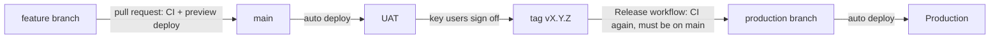

# Environments and releases

Three environments, one codebase, promoted forward only.

| | **Dev** | **UAT** | **Production** |
|---|---|---|---|
| Where | Your machine + a Vercel preview per pull request | Vercel preview of `main` (stable URL: `fab-dispatch-git-main-<team>.vercel.app`) | `fab-dispatch.vercel.app` (Vercel production, branch `production`) |
| Deploys when | You run it / every push to a PR | Every merge to `main` | A release tag `vX.Y.Z` is pushed |
| Database | SQLite (local) · UAT database (PR previews) | Supabase **UAT** project | Supabase **production** project |
| Auth | Demo sign-in (local) · Supabase (previews) | Supabase Auth | Supabase Auth |
| Who uses it | Engineers | Fab key users test before release | Dispatchers on shift |

## Flow

1. **Develop** on a short-lived branch. Open a pull request: CI runs (lint, format, tests on Python
   3.11/3.12/3.14, Postgres store and migrations, coverage ≥ 85%, frontend lint/tests/build,
   dependency audit, Docker build) and Vercel builds a preview.
2. **Merge to `main`**: UAT redeploys automatically. Its migrations run on the UAT database first,
   so a bad migration is caught there, not in production.
3. **Sign off in UAT** with the fab's key users. Add the release notes under a new version
   heading in `CHANGELOG.md`.
4. **Release**: `git tag -a v2.1.0 -m v2.1.0 && git push origin v2.1.0`. The *Release* workflow re-runs CI
   on that exact commit, refuses tags that aren't on `main`, fast-forwards `production`, and
   publishes a GitHub release from the changelog. Vercel deploys production.
5. **Smoke test**: every successful deployment (preview, UAT, production) is checked automatically:
   `/api/health` must report `status: ok` and `schema_ok: true`, and auth must be `supabase`, never demo.

## Rollback

- **App**: in Vercel → Deployments, *Promote* the previous production deployment (instant, no
  rebuild). Then fix forward on `main` and release a patch version.
- **Database**: migrations are additive (new tables, new columns with defaults), so the previous
  app version keeps working against a newer schema. Never write a destructive migration in the same
  release as the code that stops using the old structure; split it across two releases.

## Configuration per environment

Set in Vercel → Settings → Environment Variables, scoped to *Production* or *Preview* (UAT and PR
previews). The Supabase integration injects `POSTGRES_URL`, `SUPABASE_URL`,
`SUPABASE_PUBLISHABLE_KEY` and `SUPABASE_JWT_SECRET` per scope.

| Variable | Production | Preview (UAT) |
|---|---|---|
| `FAB_AUTH_MODE` | `supabase` | `supabase` |
| `FAB_DISPATCHER_EMAILS` | the fab's dispatch leads | the UAT testers |
| `FAB_DEFAULT_ROLE` | `viewer` | `viewer` |
| `CRON_SECRET` | random, ≥ 32 chars | random, ≥ 32 chars |
| Supabase database | production project | UAT project |

## Database migrations

Defined in `backend/app/store.py` (`MIGRATIONS`), numbered and append-only. They run at startup under
a Postgres advisory lock, so concurrent serverless cold starts can't race. `/api/health` reports
`schema_ok`, which the smoke test checks after every deploy.

## Data retention

Vercel Cron calls `POST /api/internal/prune` daily at 03:00 UTC with `CRON_SECRET`. It removes plan
cache entries older than 7 days, idempotency keys older than 24 hours, and shifts (with their events
and presence) not updated for 30 days.
