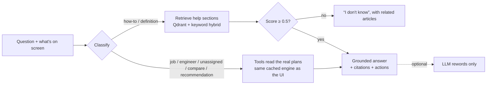

# AI transparency: the assistant

**Ask Dispatch** answers questions about the shift on screen and about the app. This page is its
model card: what it does, where answers come from, how it's measured, and its limits.

## What it's for

Helping dispatchers understand plans (*why is J006 unassigned?*, *what is E03 doing?*, *why is
PyVRP recommended?*) and use the app (*how do I report a tool-down?*). It reads; it never changes
anything: it can't start shifts, move engineers or edit data.

## How an answer is made

1. **Understand.** Pull out job ids, engineer ids and strategy names, then classify the intent.
2. **Act with tools.** Shift questions are answered from the plans for exactly what's on screen, via
   the same cached planning service the UI uses, so the assistant and the inspector always agree.
   App questions retrieve help sections: vectors in Qdrant (a dependency-free hashed n-gram
   embedder) plus keyword, heading and section-text matches.
3. **Answer, with sources.** Every answer carries citations (help sections) and actions (open a job,
   a strategy, a view).
4. **Or decline.** Below a retrieval score of **0.5**, it says it doesn't know and suggests articles.

## Evaluation

An evaluation set of real questions runs in CI on every change
([`assistant_eval.json`](https://github.com/pavansky/fab-dispatch/blob/main/backend/tests/eval/assistant_eval.json)):

| Measure | Result | Required |
|---|---|---|
| How-to questions citing the right article | **42 / 42** | ≥ 90% |
| Off-topic questions declined | **8 / 8** | all |
| Answers about a job matching the plans exactly | tested | exact |

The refusal threshold sits in a measured gap: answerable questions score **≥ 0.6**, off-topic ones
**≤ 0.36**. Every CI run publishes the current figures in its summary.

## Feedback in production

Each answer has 👍 / 👎 (with an optional note). Feedback is stored with the user id, never the email,
for 180 days, and dispatchers can see helpful rates by kind of question
(`GET /api/assistant/stats`). Poor answers become new evaluation cases.

## Optional language model

Off by default: everything above is local and needs no key. If enabled
(`FAB_ASSISTANT_LLM=anthropic` or a local `ollama` model), a model may **reword** a grounded answer:

- it sees only the question and the grounded answer, and is told to add nothing;
- citations and actions always come from the grounded answer, never from the model;
- refusals are never sent to it;
- any failure or timeout returns the grounded answer unchanged.

## Limits

- Retrieval is lexical: very unusual phrasing can miss; rephrasing usually helps.
- It knows this app and the shift on screen, nothing else, and keeps no memory between sessions.
- The data is synthetic (see [privacy](privacy.md)); answers are only as good as the plans and articles.

Found a wrong answer? Press 👎, or [report it](support.md).
